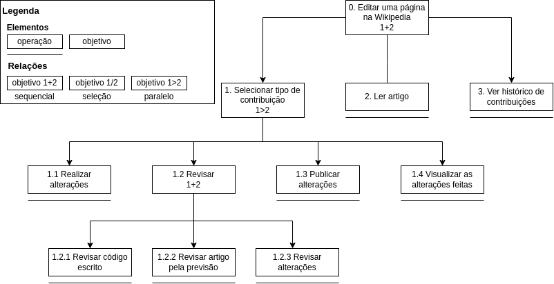

# AHT

## Introdução

A análise hierárquica de tarefas (AHT) é uma metodologia de design de interface que busca compreender as atividades que os usuários realizam em um sistema, a fim de criar uma interface mais intuitiva e eficiente.

Nesta seção, verificaremos como a análise hierárquica de tarefas foi utilizada no contexto da Wikipedia, levando em consideração as particularidades dessa plataforma tão utilizada e de grande alcance.

Quando aplicada à Wikipedia, a AHT busca identificar as principais tarefas que os usuários realizam na plataforma, como, por exemplo, buscar por informações, criar e editar artigos, entre outras. Nesta seção abordaremos a edição de um artigo, pois conforme constatado no [perfil do usuário](./perfilDeUsuario.md), essa é uma das principais funcionalidades do site em questão.

## Sobre o AHT

A Análise Hierárquica de Tarefas é composta por cinco elementos:

* Tarefa: Qualquer etapa ou parte de um trabalho que precisa ser concluída;
* Objetivo: Um resultado final que pode ser medido através de eventos ou valores observáveis;
* Subobjetivo: Um objetivo de nível superior que é dividido em objetivos menores;
* Plano: O conjunto de subobjetivos de um objetivo e as suas inter-relações formam um plano;
* Operação: As circunstâncias que ativam o objetivo (entrada), as ações ou atividades necessárias para alcançá-lo e as condições que indicam que o objetivo foi alcançado (feedback).

## Analise da tarefa: Edição de um artigo

Realizar uma contribução/edição a algum artigo é uma das principais atividades que o usuário executa no Wikipédia, visto que a colaboração é parte fundamental da manutenção da aplicação. A Tabela 1 e a Figura 1 ilustram, em diagrama e texto , respectivamente, a análise hierárquica dessa tarefa.

| Objetivos / Operações                          | Problemas e Recomendações                                                                                                                                                                                                                                                                               |
| :----------------------------------------------- | --------------------------------------------------------------------------------------------------------------------------------------------------------------------------------------------------------------------------------------------------------------------------------------------------------- |
| 0. Editar uma página na Wikipedia (1+2)    | input: tela de edição de alguma seção de um artigo feedback: página alterada é exibida para o usuário plano: realizar a contribuição e **depois** poder visualizar as alterações realizadas recomendação: exibir mensagem de sucesso ao concluir com sucesso a edição |
| 1. Selecionar tipo de contribuição (1>2) | plano: selecionar qual tipo de alteração será realizada                                                                                                                                                                                                                                                |
| 1.1 Realizar alterações                        |                                                                                                                                                                                                                                                                                                           |
| 1.2 Revisar (1+2)                           | plano: revisar o código, o artigo e as alterações realizadas                                                                                                                                                                                                                                           |
| 1.2.1 Revisar código escrito                    | problema: não existe cores para auxiliar na compreensão do código recomendação: deixar partes importantes do código destacadas com cores chamativas                                                                                                                                            |
| 1.2.2 Revisar artigo pela tela de previsão     | problema: em telas pequenas o modo "Antevisão" é desabilitado recomendação: adicionar a responsividade a telas menores                                                                                                                                                                          |
| 1.2.3 Revisar alterações                       | problema: não existe um contador de linhas no editor de texto recomendação: adicionar a enumeração no editor                                                                                                                                                                                    |
| 1.3 Publicar alterações                       | problema: não existe indicação se a publicação foi bem sucedida ou não recomendação: comunicar o status do sistema                                                                                                                                                                           |
| 1.4 Visualizar as alterações feitas            |                                                                                                                                                                                                                                                                                                           |
| 2. Ler artigo                                    | problema: as alterações são perdidas quando o usuário acessa a tela de leitura recomendação: salvar as alterações feitas pelo usuário                                                                                                                                                       |
| 3. Ver histórico de contribuições             | problema: as alterações são perdidas quando o usuário acessa a tela de histórico recomendação: salvar as alterações feitas pelo usuário                                                                                                                                                    |

    
 Tabela 1: HTA em tabela (Fonte: Chaydson. 2023).

  

    
 Figura 1: Diagrama HTA (Fonte: Chaydson. 2023).

## Bibliografia

BARBOSA, Simone D. J. Interação humano-computador. Rio de Janeiro: Elsevier, 2010.

CARD, Stuart K. The psychology of human-computer interaction. Hillsdale: Lawrence Erlbaum Associates, 1983.

## Histórico de Versão

| Versão | Data       | Descrição                                     | Autor(es) | Revisor(es) |
| ------- | ---------- | ----------------------------------------------- | --------- | ----------- |
| 1.0     | 07/05/2023 | Criação do documento                          | Chaydson  | Lucas       |
| 1.1     | 19/06/2023 | Aplicando correções apontadas na verificaçã | Samuel    | Pedro       |
