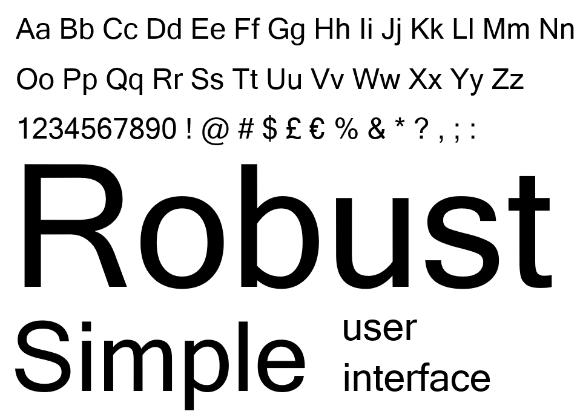
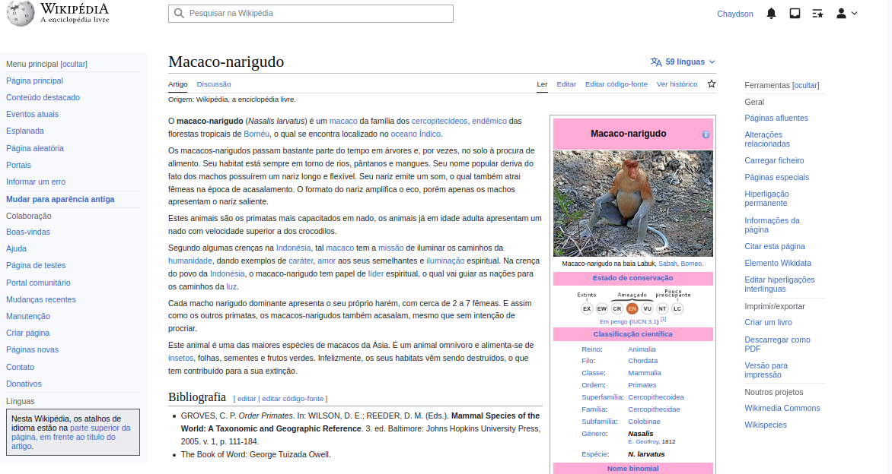

# Guia de Estilo

## Introdução

Segundo Simone (2021): "É comum, principalmente em projetos grandes, reunir os princípios e as diretrizes adotados em um documento intitulado guia de estilo. Trata-se de um registro das principais decisões de design tomadas, de forma que elas não se percam, isto é, sejam efetivamente incorporadas no produto final. Guias de estilo servem de ferramenta de comunicação entre os membros da equipe de design e também com a equipe de desenvolvimento. É importante que as decisões de design possam ser facilmente consultadas e reutilizadas nas discussões sobre extensões ou versões futuras do produto".

## Metodologia

Um guia de estilo pode ser elaborado com diferentes escopos: plataforma (composição de dispositivo e sistema operacional), corporativo (para assegurar a padronização e consistência entre produtos de uma empresa), família de produtos e um produto especifico (Mayhew, 1999).

Com isso, iremos definir o nosso guia de estilo utilizando o escopo corporativo definido por Mayhew.

## Estrutura

### Objetivo

Um guia de estilo deve incorporar decisões de design envolvendo os principais elementos e considerações
de design de interface. Marcus (1991) considera os seguintes elementos:

- layout: proporção e grids; uso de metáforas espaciais; design gráfico de exibidores e ferramentas;
- tipografia e seu uso em diálogos, formulários e relatórios;
- simbolismo: clareza e consistência no design de ícones;
- cores: os dez mandamentos sobre o uso de cores;
- visualização de informação: design de gráficos, diagramas e mapas;
- design de telas e elementos de interface (widgets).

### Organização e conteúdo do guia de estilo

1. Introdução:

   - com Objetivo do guia de estilo
   - Organização e conteúdo do guia de estilo
   - Público alvo do guia de estilos (programadores, gerentes, equipe de suporte)
   - Como utilizar o guia (em produção e manutenção)
   - Como manter o guia.

2. Resultados de análise:

   - Descrição do ambiente de trabalho do usuário

3. Elementos de interface:

   - Disposição espacial e grid
   - Janelas
   - Tipografia
   - Cores
   - Animações

4. Elementos de interação:

   - Estilos de interação
   - Seleção de um estilo
   - Aceleradores (teclas de atalho)

5. Elementos de ação:
   - Preenchimento de campos
   - Seleção
   - Ativação
6. Vocabulário e padrões:
   - Terminologia
   - Tipos de tela (para tarefas comuns)
   - Sequências de diálogos (e.g., para feedback ou confirmação de uma operação)

### Público-alvo do guia de estilos (programadores, gerentes, equipe de suporte)

Este guia de estilo visa auxiliar os estudantes da matéria de Interação Humano Computador na avaliação da plataforma Wikipedia, que integra o projeto da matéria. Ao seguir este guia, os estudantes poderão embasar suas escolhas de design em critérios e boas práticas relevantes à matéria, simplificando as outras fases do projeto e melhorando sua qualidade e eficiência.

### Como utilizar o guia de estilo

1 - Durante a produção:

- Antes de criar uma nova tela no wikipedia, familiarize-se com o Guia de Estilo.

- Utilize o guia como uma referência constante durante o processo de design e desenvolvimento. Siga as diretrizes visuais, como tipografia, cores e elementos de interface, para garantir a consistência em todo o projeto.

2 - Durante a manutenção:

- Certifique-se de que todas as equipes envolvidas no projeto estejam cientes da existência do Guia de Estilo e saibam como acessá-lo. Incentive a conscientização sobre a importância de seguir as diretrizes estabelecidas para garantir a consistência e a qualidade do produto.

3 - Utilizando o guia:

- Use o Guia de Estilo como um meio de comunicação efetivo entre as equipes de design e desenvolvimento. Ao seguir as diretrizes estabelecidas no guia, a comunicação e o alinhamento entre as equipes serão facilitados, evitando retrabalhos e garantindo a consistência do produto.

### Como manter o guia

- Mantenha o Guia de Estilo atualizado. Sempre que novas decisões de design forem tomadas ou alterações forem feitas na identidade visual ou nas diretrizes de marca, documente-as no guia.

- Não hesite em atualizar o Guia de Estilo com base no feedback dos usuários e nas lições aprendidas ao longo do desenvolvimento. O guia deve ser um documento vivo, adaptável e aprimorado continuamente para atender às necessidades do projeto.

- Ao criar novas telas ou funcionalidades, verifique se elas estão alinhadas com as diretrizes estabelecidas no Guia de Estilo. Isso ajudará a garantir a coerência visual e a usabilidade do produto final.

## Resultados de análise

### Descrição de ambiente de trabalho do usuário

O wikipedia é utilizado por diversas pessoas em diversos dispositivos, sejam eles computadores, celulares, tablets, televisões ou outros, por este motivo, é importante que o site seja adapativo em todas as plataformas, para que o usuário possa ter uma boa experiência em qualquer dispositivo. Além do mais, o site é utilizado por pessoas de todas as idades, por isso, é importante que o site seja simples e intuitivo, para que qualquer pessoa possa utilizá-lo sem dificuldades.

## Elementos de interface

### Disposição espacial e grid

O site possui um layout em que os elementos são divididos em sessões e estes são centralizados na página. A Figura 1 a seguir demonstra a disposição dos elementos da página principal e inicial do sistema.

    
 Figura 1: Layout (Fonte: Autores. 2023).

### Janelas

São diversas as janelas contidas no site, porém, pode-se destacar as principais, como a página inicial, a página de um artigo qualquer, e a página de edição de um artigo. As páginas citadas podem ser visualizadas na Figura 2, Figura 3 e Figura 4.

    
 Figura 2: Página de um artigo (Fonte: Wikipedia. 2023).

    
 Figura 3: Página inicial (Fonte: Wikipedia. 2023).

    
 Figura 4: Página de edição de um artigo (Fonte: Wikipedia. 2023).

### Tipografia

O site utiliza o Sans Serif (Figura 5) como família de fonte com tamanho de 16px.

    
 Figura 5: Tipografia do Sans serif (Fonte: Microsoft. 2023).

### Cores

O site utiliza as cores azul e branco, como pode ser visto na Figura 6.

    
 Figura 6: Paleta de cores da wikipedia (Fonte: Autores. 2023).

### Animações

O site da wikipedia é bastante simples, usa poucas tecnologias de estilização, por isso, não possui animações.

## Elementos de interação

### Estilos de interação

Na Wikipédia a interação com o usuário é feita por meio de hiperlinks e ícones que funcionam como pontes para outras páginas.

### Seleção de um estilo

Na Wikipédia foi optado por um estilo bem minimalista, pois dado a grande quantidade de telas e funcionalidades uma interface com muitas cores e elementos poderia deixaria a interface poluída.

### Aceleradores (teclas de atalho)

A Wikipédia possui um menu de acesso rápido para os principais tópicos pesquisados, por tanto podemos ver acesse acelerador na Figura 7.

    
 Figura 7: Acelerador (Fonte: Wikipédia. 2023).

## Elementos de ação

### Preenchimento de campos

Na Wikipédia o preenchimento de campos ocorre na maior parte da aplicação, pois o site se baseia principalmente na criação e edição de artigos de texto e campos de pesquisa.

### Seleção

Os elementos de seleção são mais raros, porém pode-se encontrar campos de seleção de datas e etiquetas em algumas funcionalidades da Wikipédia.

### Ativação

A ativação acontece por meio de hiperlinks e ícones.

## Vobabulário e padrões

### Terminologia

Editar: abre o editor de artigos

Ver histórico: exibe histórico de alterações do artigo

Línguas: escolha de idiomas

Ícone de pessoa: área de controle do perfil do usuário

Ícone de lista com estrela: páginas visitadas

Ícone de caixa aberta: notificações

Ícone de sino: Alertas

Ícone de marca páginas: gravar configurações de filtros atuais

### Tipos de tela (para tarefas comuns)

As principais telas da Wikipédia são as telas de leitura de artigo, a página inicial e a página de edição de artigos, que podem ser observadas, respectivamente, na Figura 8, Figura 9 e Figura 10.

    
 Figura 8: Página de leitura de artigo (Fonte: Wikipédia. 2023).

  

    
 Figura 9: Página inicial (Fonte: Wikipédia. 2023).

  

    
 Figura 10: Página de edição (Fonte: Wikipédia. 2023).

### Sequências de dialógos (para feedback ou confirmação de operação)

A Wikipédia não possui nenhum tipo de confirmação de operações e os feedbacks só são dados quando a ação foi completamente realizada.

## Bibliografia

Mayhew, Deborah J. (1999). The Usability Engineering Lifecycle: A Practitioner’s Handbook for User
Interface Design. Morgan Kaufmann, 1st edition edition.

Marcus, Aaron (1991). Graphic design for electronic documents and user interfaces. Association for
Computing Machinery, New York, NY, USA.

Barbosa, S. D. J.; Silva, B. S. da; Silveira, M. S.; Gasparini, I.; Darin, T.; Barbosa, G. D. J. (2021) Interação Humano-Computador e Experiência do usuário. Autopublicação. ISBN: 978-65-00-19677-1.

## Histórico de Versão

| Versão | Data       | Descrição                              | Autor(es)        | Revisor(es)      |
| ------ | ---------- | -------------------------------------- | ---------------- | ---------------- |
| 1.0    | 13/05/2023 | Criação do documento                   | Chaydson e Lucas | Gabriel e Samuel |
| 1.1    | 05/07/2023 | Colocando elementos do livro da Simone | Lucas e Chaydson | Gabriel          |
