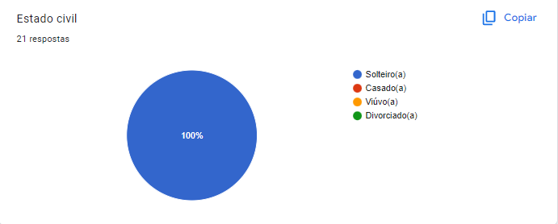
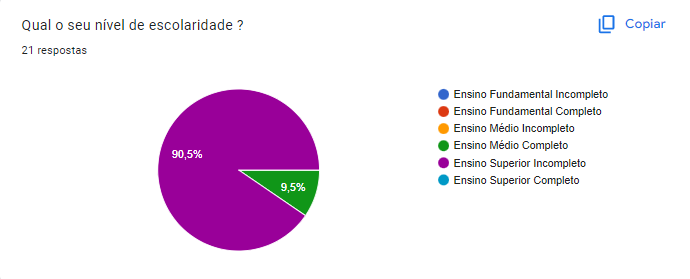
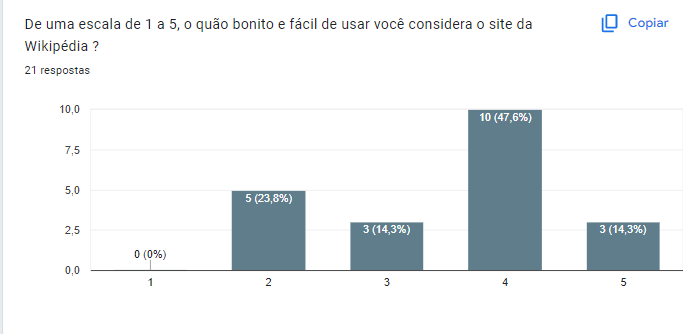
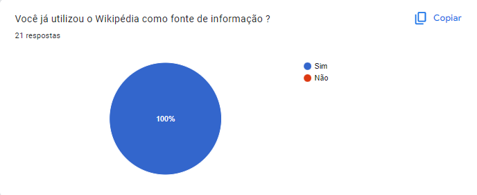
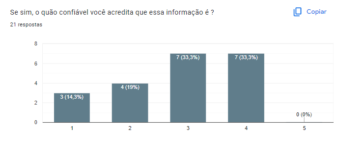

# Perfil de Usuário

## Introdução

O perfil de usuário é uma descrição detalhada das características, interesses, comportamentos e necessidades de um determinado público-alvo. Ele tem como objetivo, entendermos mais sobre os usuários que utilizam o aplicativo selecionado para a análise do grupo. Para isso, é preciso coletar informações sobre esses usuários como por exemplo quem são, seus objetivos, e também, seus dados demográficos. Assim, o perfil de usuário irá descrever o mais detalhado possível as características dos usuários do site.

## Metodologia

Para a coleta de dados, foram empregadas duas técnicas: um questionário virtual e duas pesquisas, uma baseada em estudos realizados sobre plataforma SimilarWeb, que é especializada em análise de dados e a última obtida a partir de estudos feitas por Stanford e a Wikimedia como detalhado por esses "Why We Read Wikipedia" (Wulczyn, 2017). O questionário foi criado utilizando o Google Forms, e os dados coletados foram apresentados em gráficos, o questionário foi divulgado em grupos do WhatsApp e Telegram, a fim de alcançar um público e obter uma amostra mais representativa da população estudada. Os resultados estatísticos dos gráficos foram comparados com os dados da pesquisa da SimilarWeb, a fim de aumentar a precisão dos resultados obtidos.

## Pesquisa Documental

Com a pesquisa feita em cima do "Why We Read Wikipedia" (Wulczyn, 2017), foram obtidos a motivação e certos que comportamentos do porque os leitores, leem na Wikipédia variando dos mais diversos motivos que serão explicados a seguir.

A pesquisa feita pelos pesquisadores de Stanford e da própria Wikimedia Foundation, buscou entender as motivações e comportamentos por trás de quem lia o Wikipedia dessa maneira os levou a criar um primeiro Survey, que consistiam em obter essas informações desse determinado grupo de pessoas. Os resultados de sua pesquisa que foram feitas com 5000 pessoas, e que depois de dois processos de triagem que reduziram para 500 depois 100 pessoas, com o objetivo de identificar características que definiam um grupo de categorias com opinião em comum entre os participantes, a partir desses os pesquisadores geraram dados na Tabela 1 com as categorias e descrições do que cada usuário respondeu.

| Motivação                 | Projeto do Trabalho/Escola, Decisão Pessoal, Evento Atual, Mídia, conversação,  tédio/aleatório, aprendizado intrínseco |
| --------------------------- | ------------------------------------------------------------------------------------------------------------------------------- |
| Necessidade de Informação | Informação Rápida, Visão Geral, Aprofundamento de Conhecimento                                                              |
| Conhecimento Prévio        | Familiar, Não Familiar                                                                                                         |

Tabela 1: Categorias definidas a partir de respostas do Survey (Fonte: Adaptado de Wulczyn, 2017)

Após obter tal resultado, os pesquisadores realizaram um segundo Survey com cerca de 10.500 pessoas, aplicando um peso de 1 para 200 nas respostas, pela Espanha com duas perguntas com opções abertas para escrever e de multi-escolha e uma perguntando a familiaridade com o conteúdo, para identificar o porquê das pessoas estarem lendo tais artigos, para que, e nível de familiaridade com esse artigo, gerando as respostas da Tabela 2, com apenas 2,3% usando as opções de escrever a mão as respostas, entretanto, não geraram novas categorias. Após tais respostas, os pesquisadores partiram para construir um terceiro survey.

| Pergunta                            | Respostas/Descrições                                                                                                                                                                                                                                                                                                                                                                                                 |
| ----------------------------------- | ---------------------------------------------------------------------------------------------------------------------------------------------------------------------------------------------------------------------------------------------------------------------------------------------------------------------------------------------------------------------------------------------------------------------- |
| Eu estou lendo esse artigo porque.. | eu tenho um trabalho de escola relacionado. eu tenho que tomar uma decição pessoal baseada no tópico. eu preciso de mais conhecimento sobre um evento atual ocorrido (copa do mundo, um terremoto, como por exemplo). o tópico venho em uma conversa. eu estou entediado ou explorando randomicamente o Wikipédia por diversão. acho importante o tópico e quero aprender mais sobre. |
| Eu estou lendo esse artigo para...  | procurar por um fato específico ou resposta rápida. obter um visão geral do tópico. aprofundar conhecimento sobre o tópico.                                                                                                                                                                                                                                                                             |
| Antes de visitar este artigo...     | eu já era familiar com esse tópico. eu não era familiar com esse tópico. eu estava aprendendo sobre isso pela primeira vez.                                                                                                                                                                                                                                                                              |

Tabela 2: Perguntas e Respostas Gerais do segundo Survey (Fonte: Adaptado Wulczyn, 2017)

 No terceiro Survey com a ajuda dos desenvolvedores da Wikipedia, eles utilizaram de informações relacionadas as requisições feitas em artigos contidos no site e selecionados por eles, para que isso acontecesse foram abertos um google forms, o qual foi feito com 29.372 participantes,  utilizando as mesmas perguntas feitas nos outros surveys anteriores com a adição de termo de consentimento para rastrear/guardar o ip da pessoa para identificar atividades da mesma durante a sua entrada no site, verificando e guardando a informação para quando a mesma tivesse acessado um dos tópicos que os pesquisadores escolheram.

 Dessa maneira, sabendo, que a informação sozinha não definiria o padrão de comportamento dos usuários do Wikipédia, os pesquisadores cruzaram os dados das requisições dos usuários que aceitaram participar da pesquisa com as perguntas, assim gerando resultados do survey contidos na Figura 1.

Figura 1: Grafico de Resultados do Survey com Pesos (Fonte: Wulczyn, 2017)

Na Figura 1, os dados consistem de dois de duas informações uma com os dados somente das respostas e sem pesos aplicados, sem peso, e a outra com o peso aplicado e relacionamento realizado, em verde, gerando assim resultados e informações sobre o comportamento dos leitores da wikipédia. Focando pelos dados da barra verde na Figura 1 é verificado que na motivação por procura de informações 30% tem relação com a mídia, 25% relacionado ao um conhecimento intrínseco, 22% de tópicos de conversas, 20% por está entediado, 16% relacionado ao trabalho ou escola, 13% relacionado ao um evento que está acontecendo no momento e 10% por ter que precisar de informação para tomar uma decisão pessoal. Lembrando que as as pessoas poderiam selecionar mais de um tópico.

Já para necessidade de informação 39% era para uma visão geral do assunto, 38% para um fato rápido e 21% para um aprofundamento de conhecimento, além do restante dessa porcentagem que não foi possível obter a resposta. Sobre a familiaridade com esses conteúdos a maior parte dessa público 50% possuía familiaridade com o conteúdo e 47% não possuía essa familiaridade, os 3% restantes não houve resposta.

Além desses dados que geraram a Figura 1, de acordo com o artigo, foi possível identificar depois de um aprofundamento nos dados, identificar os padrões de comportamentos do leitores, que são:

- Quando o Wikipedia é usado para trabalhos, a sessões de acesso e visualização de página tendem a ser maiores, relacionadas mais para assuntos mais sérios do que artigos relacionados a entretenimento, e o acesso é mais feito pelo computador ou desktop.
- O uso orientado a mídia é direcionado a artigos populares relacionados aos artigos de entretenimento que são menos relacionados a artigos da internet.
- Aprendizado intrínseco tende a envolver artigos de arte e ciência.
- Pessoas que navegam na Wikipédia por estarem entediados ou buscando aleatoriamente conteúdos, tendem a ser usuários que mais ficam no ativos na Wikipedia, e passarem em um ritmo acelerado os artigos que geralmente estão mais relacionados a artigos populares de entretenimento, mais do que relacionados a artigos científicos.
- Eventos atuais tendem a direcionar os usuários para artigos de esportes e
  artigos relacionados à política, tais artigos tendem a ser populares,
  provavelmente porque o evento desencadeador é uma tendência.
- Quando o Wikipédia é utilizado para se tomar decisões pessoais, os artigos estão mais relacionados a geografia e a tecnologia, provavelmente por está relacionado a uma decisão de compra ou viagem.

Algumas considerações feitas pelos pesquisadores, estão relacionadas a diversidade de usuários que os mesmos possuem, o que pode ajudar ou limitar as pesquisas dos mesmos entre outros fatores. Um dos fatores foi a questão de que os usuários mais jovens tem menos receio em responder o formulário, principalmente em aspectos que envolvem a sua idade, em comparação com os usuários mais velhos que tem mais receio, o que poderia atrapalhar em muito a pesquisa. Além disso, os usuários mais novos podem influenciar a pesquisa a ir mais para que a motivação ao uso do Wikipédia tenha mais respostas relacionadas para estudo e trabalho. Entretanto, desde que para essa pesquisa, os mesmos não incluíram nela, as idades dos participantes, mas consideraram que eles fazem parte de todas as faixas etárias, e que existem esses comportamentos em todas as categorias, os resultados ainda representam os interesses dos usuários.

Com todos os aspectos descritos anteriormente, é possível inferir, o perfil de usuário básico da Wikipédia, além de poder também poder inferir os comportamentos e possíveis expectativas em relação a que melhorias podem ocorrer no Wikipédia, as categorias de idade que esse mesmos envolvem, variam desde menores de 18 anos de idade até pessoas com mais de 65 anos de idade.

## Pesquisa Complementar

Para complementar, a pesquisa documental, e realizar uma verificação concorrente com foco no subgrupo dos estudantes, um questionário foi lançado para esse grupo na data de 27/04/2023 à 30/04/2023, e dados em sites tanto como o próprio Wikipédia quanto fora dele, no caso o SimilarWeb, que é uma ferramenta para verificar o trafégo e dados como tópico popular dentro de sites. Tudo com o objetivo de obter dados, sobre funcionalidades que o site que pode se necessitar e não existam atualmente.

## Resultados da Pesquisa e Questionário

Para a realização do questionário foi utilizado o Google Forms para a obtenção dos dados, na Figura 2, pode-se ver o termo que é necessário aceitar para continuar a entrevista, caso o usuário não concorde ele pode sair da aba da pesquisa que os dados não ficaram guardados. Além disso, foi configurado para não coleta dados como e-mail, e na coleta de dados demográficos como descrito pela Figura 2, ele foram colocadas como um amontoado de dados, sendo assim muito dificil rastreiar e expor o usuário que respondeu a pesquisa, foi pedida também a opinião dos usuários, na Figura 15, com relação a que funcionalidade podem ser adicionadas, sendo a resposta para essa opcional, com o usuário podendo responder ou não.

Figura 2: Grafico do termo do forms (Fonte: Autor,2023)

### Google Forms

Com relação à **pergunta 1** - "Qual é o seu gênero?",  como demonstrado na Figura 3, constatou-se que 76,2% dos usuários do booking.com se identificam como homens, enquanto os demais 23,8% se identificam como mulheres.

Figura 3: Grafico da pergunta 1 do forms (Fonte: Autor,2023)

Com relação à **pergunta 2** , no escopo em que a pesquisa ocorreu, foi notado como mostrado pela Figura 4 que 100% das pessoas eram solteiras, podendo está em algum tipo de relacionamento ou não.

Figura 4: Grafico da pergunta 2 do forms (Fonte: Autor,2023)

Com relação à **pergunta 3**, no escopo aplicado, a Figura 5 , demonstra que existem cerca de 90,5% são pessoas com ensino superior incompleto e 9,5% com ensino médio completo.

Figura 5: Grafico da pergunta 3 do forms (Fonte: Autor,2023)

Com relação à **pergunta 4**, a Figura 6, demonstra que 100% das pessoas da que responderam o formulário são estudantes.

Figura 6: Grafico da pergunta 4 do forms (Fonte: Autor,2023)

Com relação à **pergunta 5**, na Figura 7, foi demonstrado que 85,7% das pessoas que responderam o formulário, possuem idades entre 19 e 25 anos, enquanto 14,3% possuem menos de 18 anos.

Figura 7: Grafico da pergunta 5 do forms (Fonte: Autor,2023)

Com relação à **pergunta 6**, a Figura 8 demonstra que indo de 1 a 4, representando respectivamente, anualmente, mensalmente, semanalmente e diariamente, cerca de 9,5% das pessoas utilizam o wikipédia anualmente, 52,4% mensalmente, 38,1% semanalmente e 0% diariamente, dessa maneira representando a frequência que utilizam o site.

Figura 8: Grafico da pergunta 6 do forms (Fonte: Autor,2023)

Com relação à **pergunta 7**, a Figura 9 mostra que cerca de 23,8% das pessoas consideram o site dificil de usar e feio, 14,3% aparentam indiferença quanto a aparência do site e não consideram nem fácil, nem difícil o uso do site, e das pessoas que consideram, tem consideração positivas sobre o wikipédia representam cerca de 47,6% consideram que o mesmo é bonito e ótimo para usar, e 14,3% é próximo a perfeição do que consideram um site bonito e perfeito.

Figura 9: Grafico da pergunta 7 do forms (Fonte: Autor,2023)

Com relação à **pergunta 8**, na Figura 10, é mostrado que 100% das pessoas já utilizaram o Wikipédia como fonte de informação, o que demonstra que pelo menos em algum momento elas utilizaram para se obter informações para curiosidades, estudo, aprofundamento de conhecimento, seja para conteúdos os quais eles estejam familiares ou não.

Figura 10: Grafico da pergunta 8 do forms (Fonte: Autor,2023)

Com relação à **pergunta 9**, em contra-partida a informação da Figura 11, a confiabilidade sobre essa informação obtida não é tão alta como demonstrado na Figura 10, no qual cerca de 66,6% das pessoas que vão desde não confiam na informação obtida até são indiferentes se ela está certa ou não. E apenas cerca de 33,3% confiam na informação obtida mas não totalmente.

Figura 11: Grafico da pergunta 9 do forms (Fonte: Autor,2023)

Com relação à **pergunta 10**, essa mesma, a Figura 12, está representando por onde esses usuários acessam o Wikipédia, em sua grande maioria acessam em Celulares que contém sistema Android e/ou por Computadores, o que demonstra que responsividade do site pode ser um ponto que deve ser levado em conta.

Figura 12: Grafico da pergunta 10 do forms (Fonte: Autor,2023)

Com relação à **pergunta 11** , a Figura 13, demonstra funcionalidades que existem no site do Wikipédia, e que tem o objetivo além de verificar a porcentagem em que o usuários viram ou usaram alguma funcionalidade, assim o que os usuários mais viram foram as imagens com 85,5% e o Histórico de Versão do Artigos, todas contidas no Wikipédia, apesar de dar a opção para o usuário comentar sobre alguma funcionalidade que o grupo não tenha encontrado no site, não ouve comentários em cima desse.

Figura 13: Grafico da pergunta 11 do forms (Fonte: Autor,2023)

Com relação à **pergunta 12** , na Figura 14, foi demonstrado, opiniões voluntários dos usuários sobre funcionalidades que acreditam que o Wikipédia não realiza, que seriam interessantes de ter. Apesar, de ser necessário filtrar opiniões, que já existem no site.

Figura 14: Grafico da pergunta 12 do forms (Fonte: Autor,2023)

### Similar Web - Dados

Com relação ao Similar Web ele demonstra na Figura 16 que 55,80% dos usuários são do sexo masculino e 44,20% do dos usuários são do sexo feminino. De cerca de 4,7 bilhões de pessoas que acessam o site, sendo sua maioria de acessos advindos do celulares como a Figura 15 demonstra com 59,53% sendo usuários de telefone e 40,47% sendo usuários de computadores (Desktop), na Figura 16 também é apresentado suas faixas etárias.

Figura 15: Grafico de dispositivos que acessam o wikipedia (Fonte: SimilarWeb,2023)

Figura 16: Grafico de dados de usuários do wikipedia (Fonte: SimilarWeb,2023)

### SimilarWeb X Google Forms

Para trazer veracidade ao perfil de usuário do projeto, comparando os dados do Google Forms com o Similar Web, consegue-se ver alguma similaridade entre um dos dados, como por exemplo a idade as vantagem em termos de porcentagem que as idades abaixo de 25 anos de idade possuem sobre o resto de seu público, tais informações sobre os dados demográficos ficam ainda mais evidentes com pesquisas de idades sobre o público feito pelo WikiMedia Foundation como visto na Figura 16, que apresentam resultados semelhantes.

Figura 16: Dados Demográficos sobre os usuários da Wikipedia pesquisa feitas pelo Wikimedia Foundation (Fonte: Wikimedia Foundation,2020)

## Conclusão

Com os dados obtidos a partir de pesquisas feitas da Universidade de Stanford e Wikimedia Foundation, além de para tentar entender se houve alguma falta de detalhamento para localizar funcionalidades interessantes ou necessárias aos usuários da Wikipédia, um questionário feito pelo grupo, para o público com foco nos estudantes, que apesar de representar uma pequena parcela da intenção de uso do público, no caso, uso para deveres de escola e trabalhos, são importantes para entender certos comportamentos que os mesmos podem ter. Baseando-se nisso, podemos entender melhor, o quão diverso é o público do Wikipédia e que seu foco apesar de aparentar ser para pesquisas de estudo, ela apresenta outros pontos como foco, como por exemplo em informações rápidas e aprofundamento de conhecimento que acabam por atrair pessoas com idades acima de 25 anos, que não apareceram no questionário. Com essas informações, é possível conseguir obter dados bem definidos para gerar personas bem variadas, ou focadas, no grupo de estudantes, exisitindo os perfis de usuários da Tabela 3.

|                Perfil                | A                                          | B                                                                      | C                                                                                                               |
| :-----------------------------------: | ------------------------------------------ | ---------------------------------------------------------------------- | --------------------------------------------------------------------------------------------------------------- |
|           **Gênero**           | Em geral, usuários do sexo masculino     | Em geral, usuários do sexo masculino, mas podem ser do sexo feminino | Predominante do sexo masculino.                                                                                 |
|            **Idade**            | Variam entre 19 e 35 anos de idade       | Menores 18 anos de idade                                               | Variam entre 35 anos de idade e mais de 65 anos                                                               |
| **Experiência com Tecnologia** | Possuem facilidade com o uso da tecnologia | Possuem facilidade certa facilidade com uso da tecnologia             | Sabe utilizar, mas não domina como um todo, apenas para atividades especificas e tarefas básicas de pesquisa |
| **Atitudes perante tecnologia** | Tecnófilo                                 | Tecnófilo                                                             | Tecnófilo                                                                                                      |
|     **Tarefas Primárias**     | Leitura de Artigos, Ver Histórico        | Leitura de Artigos                                                     | Edição de Artigo,  Editar Código, Públicações de Artigos.                                                |

Tabela 3: Perfis de Usuários. Fonte - (Autor, 2023)

## Referências Bibliográficas

[1] Stanford Research. Why We Read Wikipedia. Disponível em: [https://cs.stanford.edu/people/jure/pubs/wikipedia-www17.pdf](https://cs.stanford.edu/people/jure/pubs/wikipedia-www17.pdf) . Acesso em 02 de maio de 2023.

## Bibliografia

Similarweb. Disponível em: [https://www.similarweb.com/website/wikipedia.org](https://www.similarweb.com/website/wikipedia.org). Acesso em: 28 abr. 2023.

BARBOSA, Simone; SILVA, INTERAÇÃO HUMANO-COMPUTADOR. Local de publicação: Elsevier Editora Ltda, 2010.

Research:Characterizing Wikipedia Reader Behaviour/Demographics and Wikipedia use cases. Disponível em : [https://meta.wikimedia.org/wiki/Research:Characterizing_Wikipedia_Reader_Behaviour/Demographics_and_Wikipedia_use_cases](https://meta.wikimedia.org/wiki/Research:Characterizing_Wikipedia_Reader_Behaviour/Demographics_and_Wikipedia_use_cases). Acesso em 04 de maio de 2023.

## Histórico de Versão

| Versão | Data       | Descrição                             | Autor(es) | Revisor(es) |
| ------- | ---------- | --------------------------------------- | --------- | ----------- |
| 1.0     | 29/04/2023 | Criação da página Perfil de Usuário | Gabriel   | Chaydson    |
| 1.1     | 19/06/2023 | Atualização das legendas              | Gabriel   | Lucas       |
