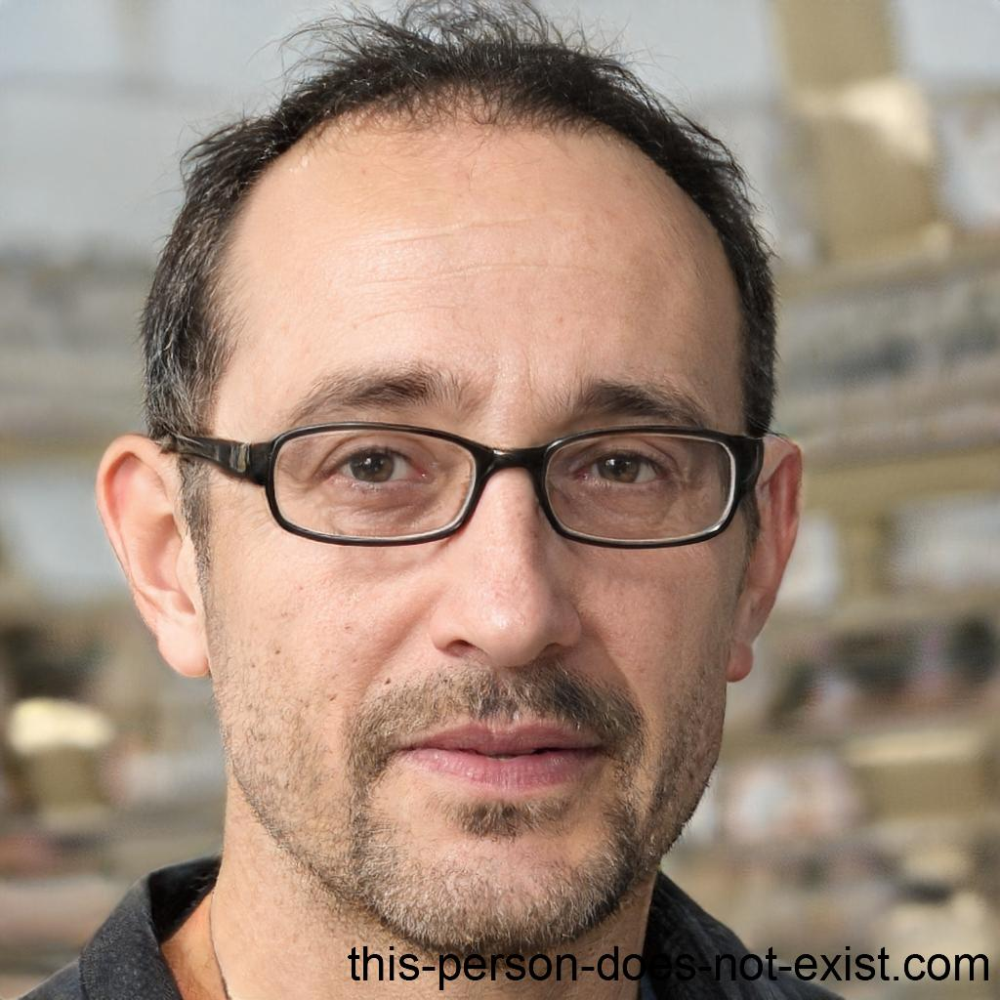
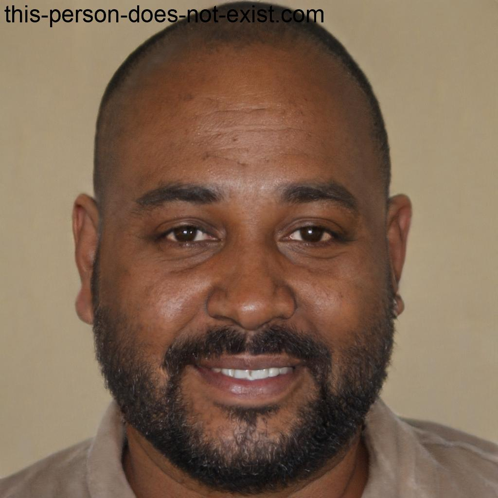

## Introdução

Aqui você encontrará uma lista de personas e antipersonas que serão utilizados para projeto. Uma persona é um personagem fictício, arquétipo hipotético de um grupo de usuários reais, criada para descrever um usuário típico (Cooper et al., 2014; Pruitt e Adlin, 2006; Cooper, 1999). Utilizaremos as mesmas para definir nosso público-alvo, o qual foram selecionadas e baseadas no [perfil de usuário](../analise-de-requisitos/perfilDeUsuario.md), assim tendo base para definir as personas.

### Metodologia

Foi escolhido 2 personas, encontradas nas tabelas 1, 2 e também foi escolhida 2 antipersonas, encontrada na tabela 3 e 4. As personas são baseadas em pessoas reais, e as antipersonas são baseadas em pessoas que não são o público-alvo do projeto. Foram escolhidos esses números pois é recomendado que sejam escolhidas de 3 a 12 personas, de acordo com Simone(2010), incluindo antipersonas.

### Como as personas serão utilizadas no projeto

Utilizaremos as personas criadas para termos uma base de como será o utilizador da plataforma, assim facilitando a criação de um projeto que atenda as necessidades do mesmo. As personas serão utilizadas para definir o público-alvo do projeto, e as antipersonas serão utilizadas para definir o que não será feito no projeto, vale ressaltar que não foi possível identificar uma persona secundária, dado o baixo nível de complexidade do site.

Vamos definir as personas de acordo com as definições de Courage e Baxter (2005), sendo elas:

- identidade
- status
- objetivos
- habilidades
- tarefas
- relacionamentos
- requisitos
- expectativas

## Personas

### Luís Silva

|                                                                                                                                                                                                                                                                                                                                                                                         |
| :--------------------------------------------------------------------------------------------------------------------------------------------------------------------------------------------------------------------------------------------------------------------------------------------------------------------------------------------------------------------------------------------------------------------------------------------: |
|                                                                                                                                                                                                              **Nome:** Luís Silva                                                                                                                                                                                                              |
|                                                                                                                                                                                                             **Gênero:** Masculino                                                                                                                                                                                                              |
|                                                                                                                                                                                                                 **Idade:** 27                                                                                                                                                                                                                  |
|                                                                                                                                                                                                  **Escolaridade:** Ensino superior incompleto                                                                                                                                                                                                  |
|                                                                                                                                                                                                        **Profissão:** Designer gráfico                                                                                                                                                                                                         |
|                                                                                                                                                                                                   **Relacionamentos:** Solteiro, sem filhos                                                                                                                                                                                                    |
|                                                                                                                                                                                                          **Status:** Persona primária                                                                                                                                                                                                          |
|                                                                                                    **Objetivos:** Luís é um curioso que adora explorar tópicos aleatórios e aprender coisas novas. Ele utiliza o Wikipedia como uma fonte acessível para satisfazer sua curiosidade e descobrir novas informações sobre assuntos diversos.                                                                                                     |
|                                                                                                                          **Habilidades:** Luís possui habilidades avançadas de pesquisa na internet e navegação em sites. Ele também tem uma boa compreensão da língua portuguesa e habilidades de leitura e escrita.                                                                                                                          |
| **Tarefas:** Luís utiliza o Wikipedia diariamente para explorar tópicos diversos e aprender coisas novas. Ele geralmente começa suas pesquisas com um tópico de seu interesse e acaba navegando por vários outros artigos relacionados. Luís também dedica tempo para revisar as informações encontradas e absorver novos conhecimentos. Ele utiliza o que aprendeu em suas conversas do dia-a-dia e para melhorar seu desempenho no trabalho. |
|                                                                                        **Requisitos:** Para satisfazer sua curiosidade, Luís precisa de acesso a uma ampla variedade de informações precisas e confiáveis, que possam ser facilmente compreendidas por ele. Ele também precisa de uma plataforma de pesquisa fácil de usar e acessível.                                                                                        |
|                                                                                                                                                                          **Expectativas:** Luis acredita que a Wikipedia é um site de pesquisa de informações gerais.                                                                                                                                                                          |
|                                                                                                                                                                                        **Endereço:** Luís mora com seu cachorro em Caxias do Sul - RS.                                                                                                                                                                                         |
|                                                                                                                                                                                              **Locomoção:** Luís se locomove em sua motocicleta.                                                                                                                                                                                               |

 Tabela 1: Primeira persona primária (Fonte: Autores. 2023).

### Rodrigo Lucas da Cunha

|                                                                                                                                                                                                                  |
| :------------------------------------------------------------------------------------------------------------------------------------------------------------------------------------------------------------------------------------------------------------------------: |
|                                                                                                                      **Nome:** Rodrigo Lucas da Cunha                                                                                                                      |
|                                                                                                                           **Gênero:** Masculino                                                                                                                            |
|                                                                                                                               **Idade:** 50                                                                                                                                |
|                                                                                                                 **Escolaridade:** Ensino superior completo                                                                                                                 |
|                                                                                                                   **Profissão:** Pesquisador cientifíco                                                                                                                    |
|                                                                                                                  **Relacionamentos:** Casado, sem filhos                                                                                                                   |
|                                                                                                                        **Status:** Persona primária                                                                                                                        |
|       **Objetivos:** Rodrigo é um pesquisador com interesse em divulgar o conhecimento por meio do Wikipedia. Ele deseja escrever artigos completos e precisos sobre temas específicos da sua área de pesquisa e compartilhar esse conhecimento com outras pessoas.        |
|                          **Habilidades:** Por ser um pesquisador experiente e possui conhecimento aprofundado em sua área de estudo, além de possuir habilidades de escrita e comunicação para transmitir informações de forma clara e objetiva.                           |
| **Tarefas:** Rodrigo dedica grande parte de seu tempo para realizar pesquisas, levantar informações e analisar dados. Ele também dedica tempo para escrever e revisar seus artigos antes de publicá-los no Wikipedia. Geralmente ele realiza essas tarefas uma vez no mês. |
|                                                                               **Requisitos:**  Ele precisa de uma plataforma de publicação confiável e acessível para publicar seus artigos.                                                                               |
|                                      **Expectativas:** Rodrigo acredita que a WIkipedia é um site onde ele pode publicar suas pesquisas de forma a democratizar o acesso a informação, dado a não necessidade de assinatura do site.                                       |
|                                                                                                         **Endereço:** Rodrigo mora com sua esposa em Itabuna - BA                                                                                                          |
|                                                                                                             **Locomoção:** Rodrigo anda em seu carro próprio.                                                                                                              |

 Tabela 3: Terceira persona Primária (Fonte: Autores. 2023).

## Antipersonas

### Nelson Ricardo Jesus

|                                                                                                                                                                                                                                                      |
| :-----------------------------------------------------------------------------------------------------------------------------------------------------------------------------------------------------------------------------------------------------------------------------------------------------------: |
|                                                                                                                                        **Nome:** Nelson Ricardo Jesus                                                                                                                                         |
|                                                                                                                                             **Gênero:** Masculino                                                                                                                                             |
|                                                                                                                                                 **Idade:** 45                                                                                                                                                 |
|                                                                                                                                      **Escolaridade:** Sem escolaridade                                                                                                                                       |
|                                                                                                                                            **Profissão:** Pedreiro                                                                                                                                            |
|                                                                                                                                     **Relacionamentos:** Casado, 1 filha                                                                                                                                      |
|                                                                                                                                            **Status:** Antipersona                                                                                                                                            |
|                                                                                     **Objetivos:** Por ser um analfabeto, Nelson não consegue escrever e nem ler, por este motivo, o site da wikipédia não lhe interessa.                                                                                     |
| **Habilidades:**  Nelson enfrenta desafios ao usar tecnologia, especialmente quando se trata de aplicativos de pesquisa. Como ele não sabe ler e escrever, é difícil para ele navegar pelos aplicativos e encontrar informações. Quando ele precisa pesquisar sobre algo, ele pede ajuda sua esposa ou filha. |
|                                                                                                    **Expectativas:** Não possui expectativas com a wikipédia, dado sua incapacidade de leitura e escrita.                                                                                                     |
|                                                                                                                 **Endereço:** Nelson mora com sua esposa em Recanto das Emas - Brasília - DF                                                                                                                  |
|                                                                                                                              **Locomoção:** Nelson se locomove em sua bicicleta.                                                                                                                              |

 Tabela 4: Primeira Antipersona (Fonte: Autores. 2023).

### Francisco Davi Ramos

|                                                                                                                                           |
| :---------------------------------------------------------------------------------------------------------------------------------------------------------------------------------------------------: |
|                                                                                    **Nome:** Francisco Davi Ramos                                                                                     |
|                                                                                         **Gênero:** Masculino                                                                                         |
|                                                                                             **Idade:** 25                                                                                             |
|                                                                                **Escolaridade:** Ensino médio completo                                                                                |
|                                                                                      **Profissão:** Desempregado                                                                                      |
|                                                                               **Relacionamentos:** Solteiro, sem filhos                                                                               |
|                                                                                        **Status:** Antipersona                                                                                        |
|                    **Objetivos:** Perturbar e desestabilizar a comunidade da Wikipedia, introduzindo informações falsas, removendo conteúdo relevante e gerando um ambiente hostil                    |
|                                                                **Habilidades:**  Francisco possui bastante habilidades de informatica.                                                                |
| **Tarefas:** Acorda tarde, toma seu café da manhã, uma coca-cola do dia anterior com um pão de queijo, após isso, ele joga vídeo game até de noite, após isso, ele gosta de espalhar notícias falsas  |
|                                        **Expectativas:** Conseguir influenciar negativamente diversas pessoas, se divertir com a desinformação sendo passada.                                         |
|                                                                    **Endereço:** Francisco mora com seus pais em Taguantiga - DF.                                                                     |
|                                                                              **Locomoção:** Francisco se locomove à pé.                                                                               |

 Tabela 5: Segunda Antipersona (Fonte: Autores. 2023).

## Bibliografia

‌BARBOSA, Simone Diniz Junqueira; DA SILVA, Bruno Santana. Interação Humano - Computador. Rio de janeiro: Elsevier, 2010. Acesso em 30 de abril de 2023.

UNIVESP. Engenharia de Computação - 16º Bimestre - Interfaces Humano-Computador – EES-301. Youtube, 15 out. 2021. Disponível em: https://youtu.be/duxDSDzxemk. Acesso em: 30 abr. 2023.

‌This Person Does not exist. Disponível em: https://this-person-does-not-exist.com/en. Acesso em 15 de maio de 2023.

Courage, Catherine e Baxter, Kathy (2005). Understanding Your Users: A Practical Guide to User
Requirements Methods, Tools, and Techniques. Morgan Kaufmann Publishers Inc., San Francisco,
CA, USA, 1st edition.

## Histórico de Versão

| Versão | Data       | Descrição                                     | Autor(es)             | Revisor(es)   |
| ------ | ---------- | --------------------------------------------- | --------------------- | ------------- |
| 1.0    | 30/04/2023 | Criação da página de personas                 | Pedro, Lucas e Samuel | Gabriel e Ana |
| 1.1    | 04/05/2023 | Variando as personas                          | Lucas e Pedro         | Gabriel e Ana |
| 1.2    | 19/06/2023 | Aplicando ajustes pedidos na verificação      | Lucas e Pedro         | Gabriel       |
| 1.3    | 04/07/2023 | Aplicando ajustes com base no livro da Simone | Lucas e Pedro         | Gabriel       |
