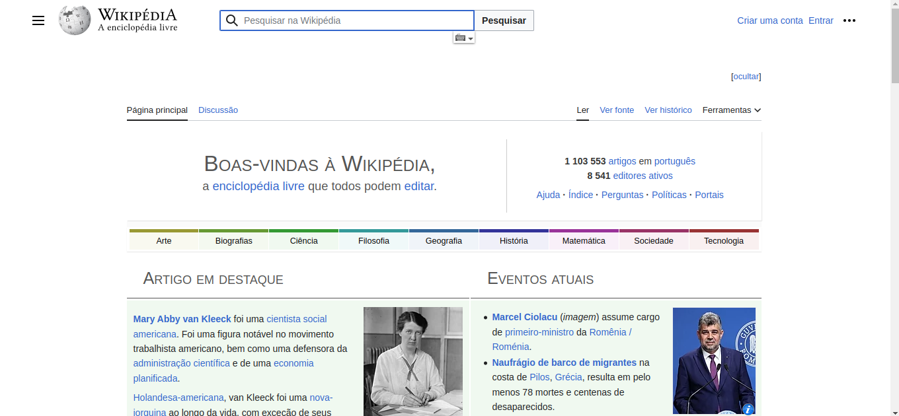
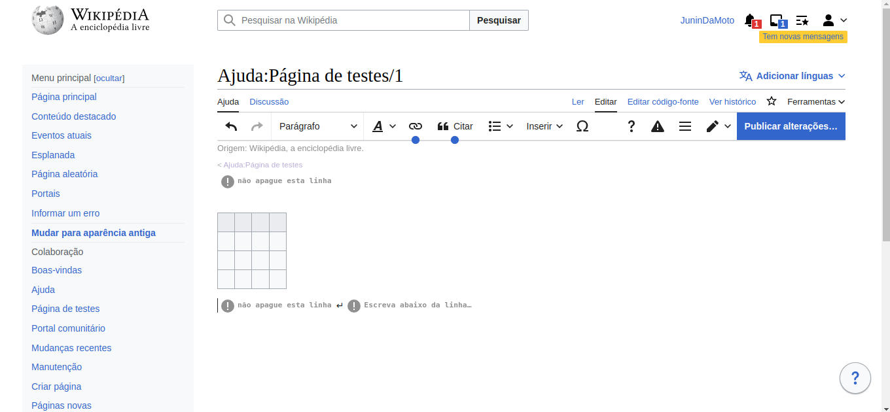
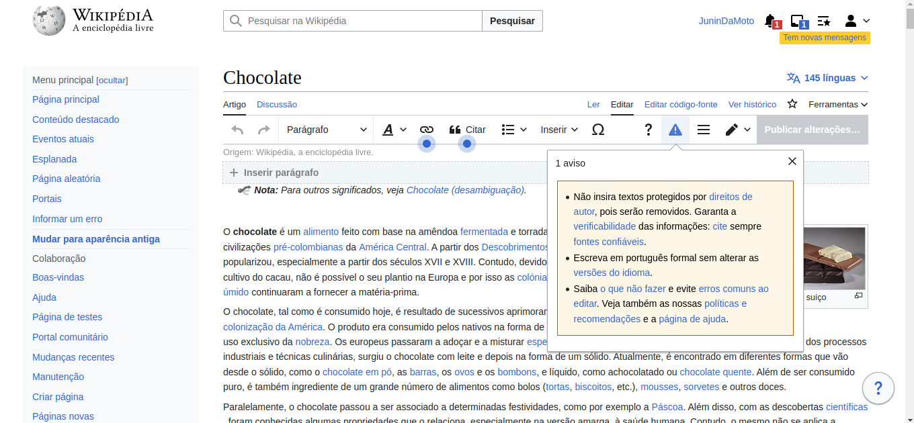
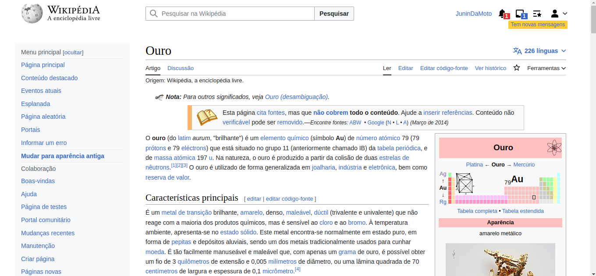
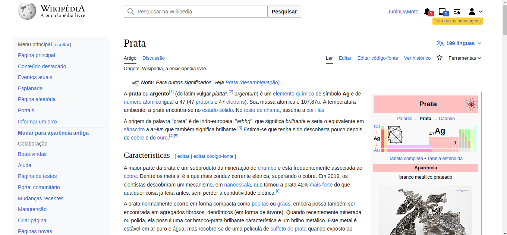
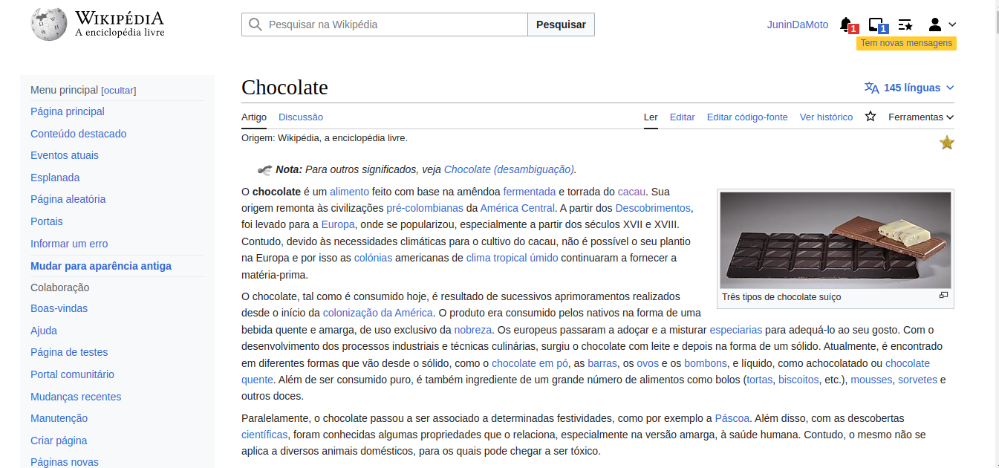
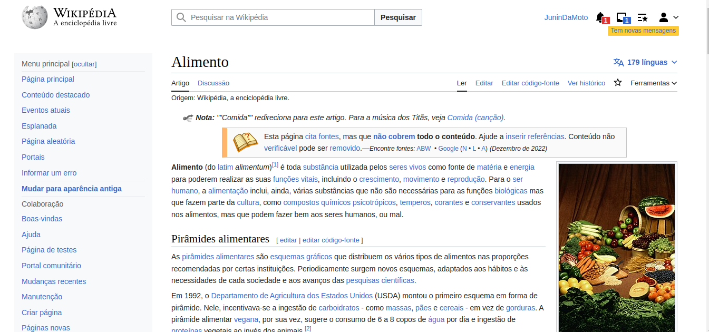
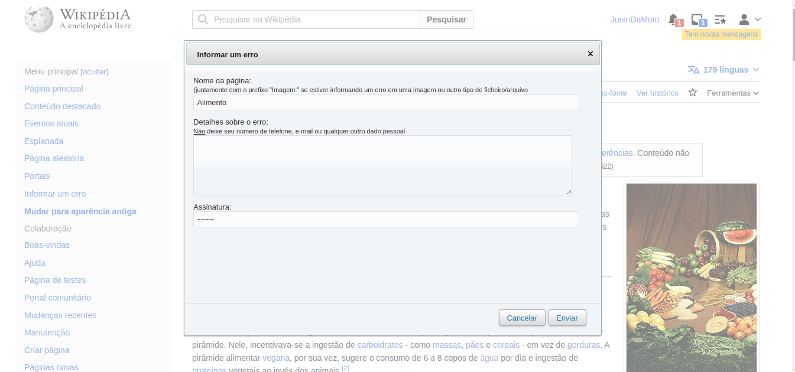

## Introdução

Os Princípios Gerais do Projeto se baseiam na necessidade de projetar o sistema utilizando um modelo conceitual, o qual deve auxiliar a interpretar o relacionamento entre as ações e informações apresentadas pelo sistema e o conhecimento do mundo. Esses princípios, frequentemente usados em IHC, se baseiam em correspondência com as expectativas dos usuários; simplicidade nas estruturas das tarefas; equilíbrio entre controle e liberdade do usuário; consistência e padronização; promoção da eficiência do usuário; antecipação das necessidades do usuário; visibilidade e reconhecimento; conteúdo relevante e expressão adequada; e projeto para erros [1]. Neste artefato seŕa apresentado o conceito dos Princípios Gerais, com base no livro Interação Humano Computador dd Simone Barbosa, e também esses princípios aplicados ao projeto. A aplicação desses princípios de design na Wikipédia visa fornecer aos usuários uma experiência agradável, eficiente, confiável e útil. Isso contribui para o sucesso contínuo da plataforma, incentivando a participação dos usuários, a colaboração e a disseminação do conhecimento e garantindo melhor experiência do usuário, aumento da usabilidade, confiabilidade, eficiência e satisfação do usuário.

## Princípios Gerais

- Correspondência com as Expectativas dos Usuários: O projetista deve seguir as convenções do mundo real. É importante entender a sequência de ações que são familiares aos usuários, e caso fuja um pouco do padrão deve ao menos seguir uma ordem lógica. Ou seja o usuário deve ser capaz de conseguir determinar os relacionamentos entre: intenções e ações possíveis; entre ações e seus efeitos no sistema; entre o estado real do sistema e o que é percebido pela visão, audição ou tato; entre o estado percebido do sistema e as necessidades, intenções e expectativas do usuário. [1]

- Simplicidade nas Estruturas das Tarefas: Se resume na palavra "simplificar". Tarefas desnecessariamente complexas podem ser reestruturadas, em geral utilizando inovações tecnológicas. As estruturas das tarefas devem ser simplificadas e é necessário tomar cuidado para a automação não tirar controle demais do usuário, escravizando-o ou tornando-o tão dependente da tecnologia a ponto de reduzir ou até mesmo eliminar sua capacidade de trabalhar sem a automação. [1]

- Equilíbrio entre Controle e Liberdade do Usuário: É importante manter o usuário no controle, pois o computador, a interface e o ambiente de trabalho “pertencem” ao usuário. Assim o aprendizado é mais eficaz e rápido. É também importante manter o equilíbiro, visto que sem limites ou restrições os usuários se sentem perdidos. É recomendado projetar restrições para que o usuário sinta que só tenha apenas uma coisa possível a se fazer. Os usuários não devem ficar presos num caminho de interação único para realizar uma atividade. O caminho mais rápido ou preferencial pode ser o de “menor resistência”, mas usuários que queiram explorar diferentes alternativas e cenários devem conseguir fazê-lo. Sempre deve ser fornecida aos usuários uma “saída” clara e rápida, mas deve ser mais fácil se manter “no caminho” do que sair dele inadvertidamente. A decisão entre oferecer mais ou menos
liberdade ao usuário varia com o seu perfil. [1]

- Consistência e Padronização: A padronização, ou seja, a consistência da interface com o modelo conceitual embutido no sistema facilita o aprendizado. É recomendável padronizar ações relacionadas em situações semelhantes para que elas funcionem da mesma forma. Por exemplo, um botão Fechar não deve ser utilizado para cancelar um diálogo em algumas situações e para confirmá-lo em outras. Da mesma forma, se dois elementos de interface possuem comportamento diferente, eles devem ter aparências distintas. Tognazzini, Nielsen e Shneiderman recomendam padronizar as ações, os resultados das ações, o layout dos diálogos e as visualizações de informação. [1]

- Promoção da Eficiência do Usuário: Considerar a eficiência do usuário em primeiro lugar. Recomenda-se que processamentos  demorados sejam processados em background, permitindo que o usuário continue realizando suas tarefas com outras partes do sistema. Segundo Cooper (1999), o sistema deve ser sensível ao que o usuário está fazendo e não deve interrompê-lo desnecessariamente enquanto o usuário estiver trabalhando em algo.

- Antecipação das Necessidades do Usuário: As aplicações devem prever o que o usuário precisa, ou seja, devem "tomar iniciativa" e fornecer informações adicionais úteis. O software deve antecipar e se preparar para situações que provavelmente acontecerão. Ou seja, prever o que o usuário quer e precisa, em vez de esperar que os usuários busquem ou coletem informações ou invoquem ferramentas. O designer deve fornecer ao usuário todas as informações e ferramentas necessárias para cada passo do processo [2]. Além disso, o software deve ser observador e se lembrar quais ações o usuário realiza em
sequência, para tentar antever o próximo passo a cada momento e facilitar a sua execução.

- Visibilidade e Reconhecimento: O estado do sistema, objetivos, ações e opções devem estar atualizados e facilmente perceptíveis ao usuário. As instruções de uso do sistema devem estar visíveis ou facilmente acessíveis sempre que necessário. Isso é importante para que o usuário não precise memorizar ações ou caminhos ou o estado do sistema. O usuário não deve ter de se lembrar para que serve um elemento de interface cujo símbolo não é reconhecido diretamente. Também não deve ter de se lembrar de informações de uma parte da aplicação quando tiver passado para uma outra parte da aplicação. [1]

- Conteúdo Relevante e Expressão Adequada: Uma interação polida segue quatro máximas: qualidade, quantidade, relevância e clareza. A máxima de qualidade diz que não devemos mentir ou especular. A máxima de quantidade está fortemente relacionada com a simplicidade da interface. A máxima da relevância afirma que tudo o que for dito deve ter relação clara com os tópicos da conversa. A máxima de clareza busca a objetividade, e evita prolixidade e ambiguidade.

- Projeto para Erros: Se resume a tratamento de erro. O designer deve tentar evitar que erros ocorram caso possível, mas se por ventura não seja possível evitar o erro então o sistema deve ser capaz de detectá-lo e oferecer mecanismos simples e inteligíveis para tratá-lo. O designer deve ajudar os usuários a reconhecerem, diagnosticarem e se recuperarem de erros. Mensagens de erro devem estar em linguagem simples, indicar o problema e sugerir uma solução. Além disso é  recomendado não colocar controles de funções utilizadas com frequência adjacentes a controles perigosos ou que raramente são utilizados[3]. Além de erros, também devemos apoiar os usuários a esclarecerem suas dúvidas durante a interação. Para isso, precisamos elaborar ajuda e documentação de alta qualidade. [1]

## Aplicação dos princípios gerais no projeto

- Correspondência com as Expectativas dos Usuários: A Wikipédia segue convenções familiares aos usuários, como a barra de pesquisa no topo da página, como pode ser visto na figra 1, e a navegação por links internos. Isso ajuda os usuários a se sentirem familiarizados. Ao relacionar tópicos e subtópicos a Wikipédia permite uma navegação clara entre os conteúdos encontrarem rapidamente o que estão buscando. Entretanto, ao clicar em um link interno a Wikipédia não fornece o estado do sistema, ou o caminho onde o usuário se encontra e onde estava. 

 Figura 1: Tela inicial Wikipédia (Fonte: Gabriel, 2023). 

- Simplicidade nas Estruturas das Tarefas: A estrutura das tarefas no site é simplificada, com os artigos organizados em seções claramente definidas. Os elementos de navegação são diretos, permitindo aos usuários percorrer os artigos de forma fácil e rápida. As ações de criação e edição, por exemplo, não obrigam o usuário a conhecer códigos wikis para realizar tais tarefas, ao invés disso oferecem uma estrutura simplificada como, por exemplo, para criação de uma tabela, mostrado na figura 2, que em códigos wiki seria uma tarefa bem mais complexa para quem não tem conhecimento.

 Figura 2: Edição de Tabela (Fonte: Gabriel, 2023). 

- Equilíbrio entre Controle e Liberdade do Usuário: O site permite que os usuários tenham controle sobre sua experiência ao fornecer a capacidade de editar artigos e contribuir para o conteúdo. No entanto, existem restrições e diretrizes para garantir a qualidade e a precisão das informações. Quando o usuário que editar um artigo, ao clicar no botão de edição ele recebe um aviso com algumas restrições para realizar a ação desejada, como é possível observar na figura 3. Além disso também há artigos que o usuário não pode editar e dessa forma o site não oferece a visibilidade do botão de editar.

 Figura 3: Edição de artigo (Fonte: Gabriel, 2023). 

- Consistência e Padronização: Em geral site segue uma estrutura e formato padronizados para seus artigos, com seções comuns como "Introdução", "História" e "Referências". Apesar disso, como a Wikipédia é uma plataforma colaborativa ela apresenta variações na padronização. Por exemplo na figura 4 há um artigo sobre ouro e na figura 5 há um artigo sobre prata. Apesar de serem assuntos que podem ser relacionados, a contrução de um artigo para outro é bem diferente, isso mostra a falta de padronização.

 Figura 4: Artigo sobre ouro (Fonte: Gabriel, 2023). 

 Figura 5: Artigo sobre prata (Fonte: Gabriel, 2023). 

- Promoção da Eficiência do Usuário: A Wikipédia tenta priorizar a eficiência do usuário, permitindo que os usuários encontrem o que estão procurando rapidamente. Mas ainda há pontos que podem ser melhorados para melhor experiência do usuário. Por exemplo, durante o processo de edição, ao adicionar uma imagem com tamanho bastante grande ao artigo pode ocorrer um processamento demorado para fazer upload e renderizar a imagem no artigo. O sistema da Wikipédia poderia permitir que o usuário faça o upload da imagem em segundo plano, sem interromper a tarefa principal de edição.

- Antecipação das Necessidades do Usuário: O site antecipa as necessidades dos usuários ao fornecer links para artigos relacionados, referências e fontes adicionais. Isso ajuda os usuários a explorar tópicos relacionados e obter informações mais abrangentes. Entretando, são tantos links relacionados que o usuário pode acabar se sentindo perdido durante a navegação. Observe a quantidade de links no artigo sobre chocolate, na figura 6.

 Figura 6: Artigo sobre chocolate (Fonte: Gabriel, 2023). 

- Visibilidade e Reconhecimento: O estado do sistema visível ao usuário, com indicações de informações claras de edições recentes, discussões ativas e outras atividades relevantes. As instruções de uso estão disponíveis nas páginas de ajuda e diretrizes da comunidade. Entretando uma das principais atividades do site não segue esse princípio, que são os links relacionados dentro do artigo. Os links são úteis para que o usuário possa abranger seu conhecimento, mas ao clicar em um link o sistema não apresenta o caminho que o usuário está percorrendo e isso pode deixar o usuário perdido. Suponhamos que na figura 6 o usuário tenha clicado no link alimento, o site direciona para a página de alimento, mostrado na figura 7, mas não mostra nada que indique ao usuário qual caminho percorreu.

 Figura 7: Artigo sobre alimento (Fonte: Gabriel, 2023). 

- Conteúdo Relevante e Expressão Adequada: Considerando que a Wikipédia é uma plataforma colaborativa é possível que haja violação das máximas de qualidade, quantidade, relevância e clareza, como nos exemplos a seguir:

    * Máxima de qualidade: Um exemplo que viola a máxima de qualidade seria se um usuário inserisse informações falsas ou especulativas em um artigo da Wikipédia. Isso poderia comprometer a credibilidade e a confiabilidade do conteúdo. No entanto, a Wikipédia possui uma comunidade de editores que trabalha para identificar e corrigir essas informações imprecisas.

    * Máxima de quantidade: Um exemplo relacionado à máxima de quantidade seria se um artigo na Wikipédia apresentasse um excesso de informações desnecessárias ou não relevantes para o tópico em questão. Isso poderia dificultar a leitura e compreensão do conteúdo, comprometendo a clareza e a objetividade.

    * Máxima de relevância: Um exemplo que viola a máxima de relevância seria se um usuário inserisse informações ou referências que não tivessem uma relação clara com o tópico principal do artigo. Isso poderia levar a uma falta de coesão e coerência no conteúdo, dificultando a compreensão para os leitores.

    * Máxima de clareza: Um exemplo relacionado à máxima de clareza seria se um artigo fosse escrito de forma prolixa, com frases longas e complexas, tornando a leitura confusa e dificultando a compreensão. A clareza e a objetividade são fundamentais para garantir que o conteúdo seja acessível e compreensível para os usuários.

- Projeto para Erros: A Wikipédia permite que os usuários relatem erros, como informações imprecisas ou falta de fontes. O sistema é capaz de detectar erros, e os usuários são incentivados a ajudar a reconhecer, diagnosticar e corrigir erros por meio do processo de edição e revisão. Na figura 8 é possível observar o pop up que abre quando o usuário deseja informar um erro.

 Figura 8: Diálogo para informar erro (Fonte: Gabriel, 2023). 

## Conclusão

Em conclusão, a Wikipédia demonstra aderência a vários dos princípios descritos, o que acaba contribuindo com a usabilidade geral do site. É importante ressaltar que a Wikipédia é uma plataforma colaborativa, e a qualidade da experiência do usuário pode variar de acordo com a contribuição e revisão dos seus milhares de voluntários. Apesar disso, o site se esforça para fornecer uma experiência de usuário eficaz e acessível. A análise feita nesse artefato contribuirá para melhor desenvolvimento do projeto, visando sempre propor uma melhora no site, com a aplicação dos princípios descritos.

## Referência Bibliográfica

[1] BARBOSA, Simone; DINIZ, Bruno. Interação Humano-Computador. Editora Elsevier, Rio de Janeiro, 2010.

[2] TOGNAZZINI, Bruce. First Principles of Interaction Design. 2014

[3] COOPER, Alan. The Inmates Are Running the Asylum: Why High Tech Products Drive Us Crazy
and How to Restore the Sanity. 1999

## Histórico de Versão

| Versão | Data       | Descrição                          | Autor(es) | Revisor(es) |
| ------- | ---------- | ------------------------------------ | --------- | ----------- |
| 1.0     | 15/05/2023 | Descrição dos princípios gerais | Ana Luiza   | Pedro   |
| 1.1     | 22/05/2023 | Usabilidade dos princípios gerais no projeto | Ana Luiza   | Pedro   |