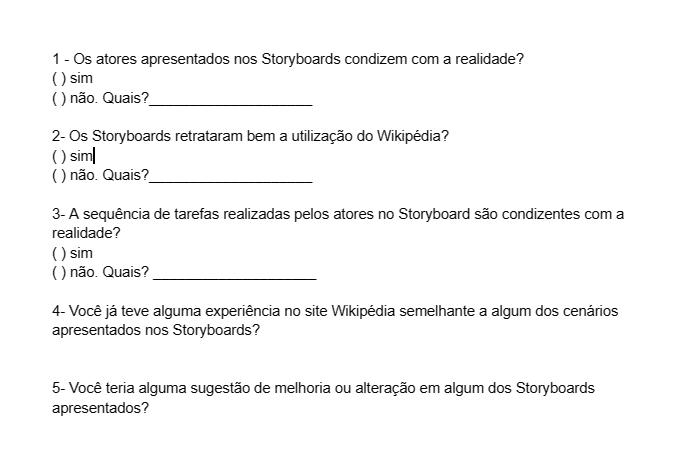
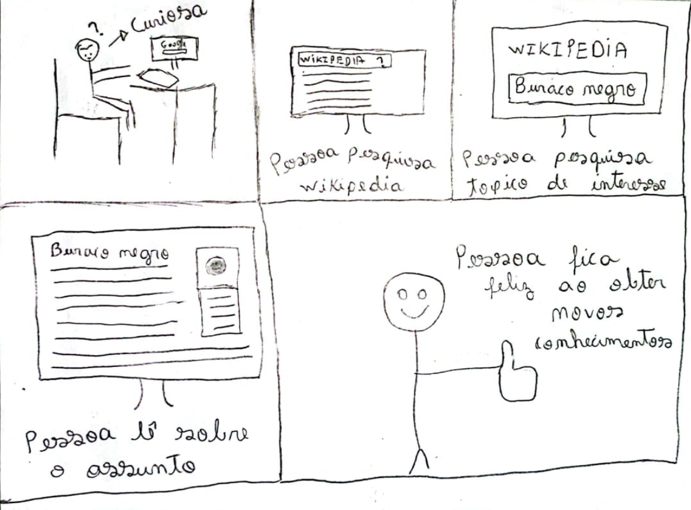
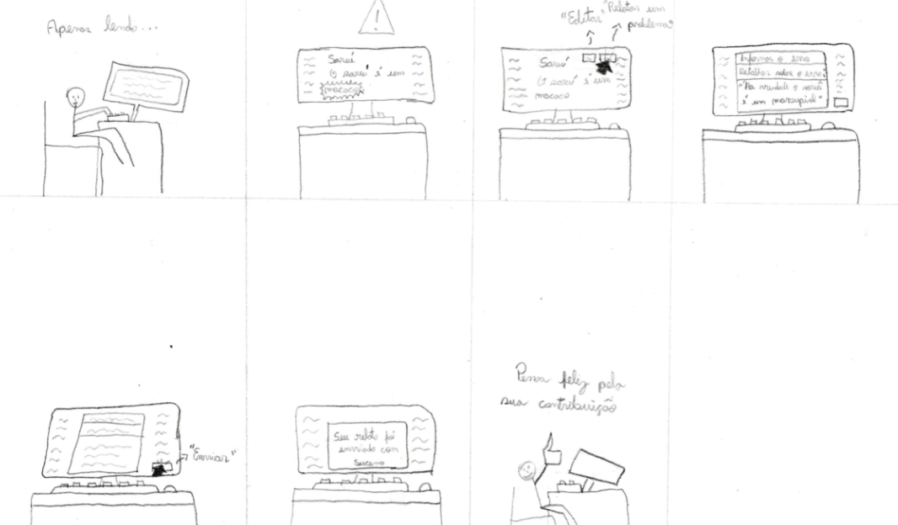
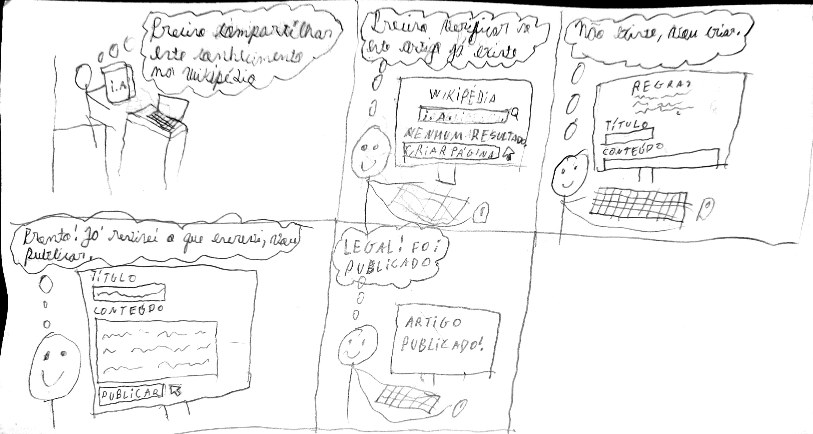
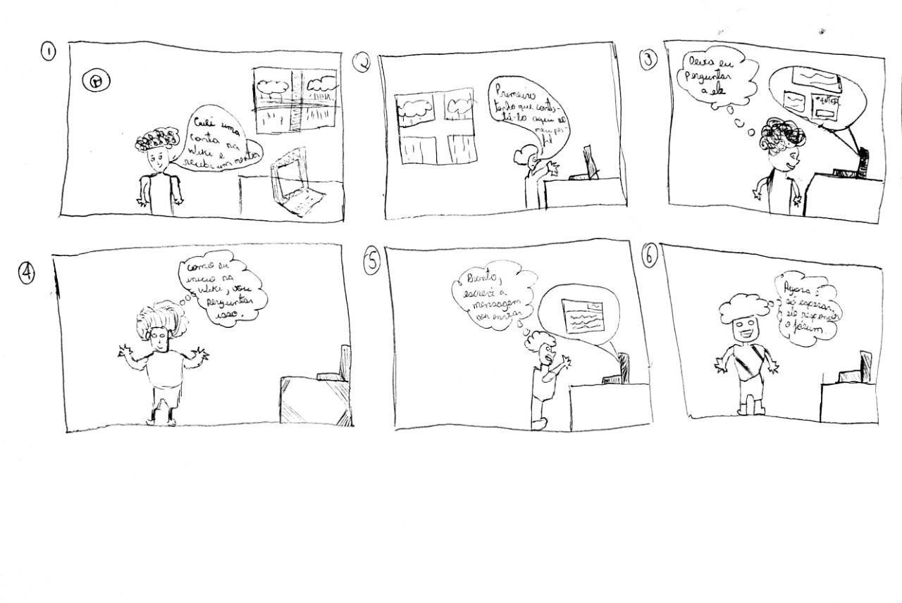
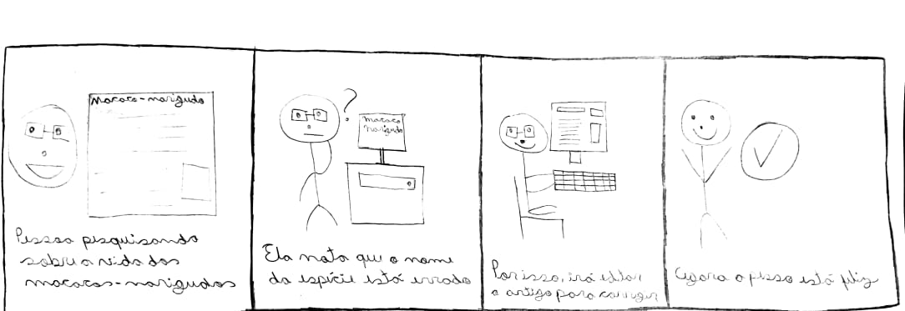
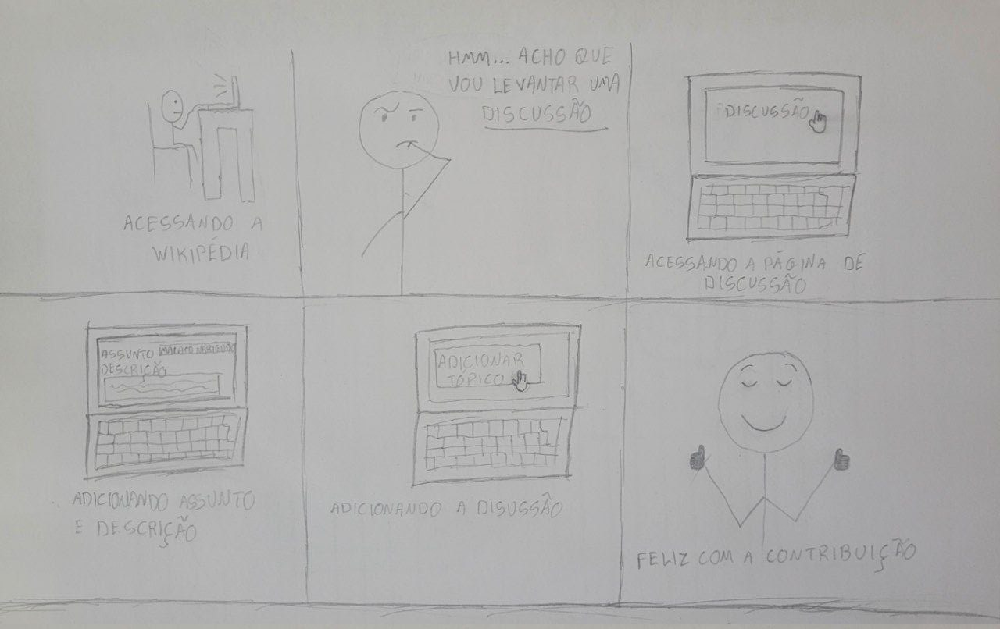

## Introdução

No contexto da engenharia de software, o storyboard desempenha um papel fundamental como ferramenta visual no planejamento, comunicação e visualização de interfaces de usuário, fluxos de trabalho e interações em sistemas ou aplicativos antes de sua implementação. Sua utilização permite que os profissionais de engenharia de software mapeiem os fluxos de trabalho, identifiquem problemas de usabilidade e tomem decisões embasadas sobre a interface e a experiência do usuário. Além disso, o storyboard serve como base para a criação de protótipos interativos e orienta a definição dos requisitos funcionais do software. Considerando esse contexto, este documento tem como objetivo realizar um planejamento para avaliar os storyboards desenvolvidos por cada membro do grupo (totalizando 6 storyboards). Esses storyboards foram elaborados tomando como base a análise de tarefas onde foi utilizado o método [AHT](../../../analise-de-requisitos/aht.md) e [GOMS](../../../analise-de-requisitos/goms.md). O objetivo desse planejamento é criar uma direção a ser seguida desde preparação da avaliação até analise dos resultados a fim de obter melhorias para o projeto.

## Metodologia

O planejamento se baseará no uso do framework DECIDE e utilizará o método da entrevista. A combinação do framework DECIDE com o método da entrevista e o método de avaliação através de observação. A sinergia entre o framework DECIDE, a metodologia de entrevistas e a observação na avaliação cria uma abordagem poderosa e altamente eficaz. O DECIDE desempenha um papel fundamental ao estabelecer metas claras, identificar questões essenciais, selecionar métodos adequados e analisar resultados de maneira criteriosa. Por outro lado, as entrevistas oferecem uma perspectiva mais profunda dos participantes, enquanto a observação traz à tona as opiniões e os sentimentos dos usuários em relação às funcionalidades do site.

Na Tabela 1 a seguir, são apresentados os componentes do framework DECIDE juntamente com seus respectivos significados. Posteriormente, é explicado como cada componente será aplicado no projeto.

| Componente | Descrição                                                     |
| :--------: | ------------------------------------------------------------- |
|   **D**    | Determinar os objetivos da avaliação de IHC.                  |
|   **E**    | Explorar perguntas a serem respondidas com a avaliação.       |
|   **C**    | Escolher (Choose) os métodos de avaliação a serem utilizados. |
|   **I**    | Identificar e administrar as questões práticas da avaliação.  |
|   **D**    | Decidir como lidar com as questões éticas.                    |
|   **E**    | Avaliar (Evaluate), interpretar e apresentar os dados.        |

    
 Tabela 1: Framework DECIDE (Fonte:Barbosa, Silva, Silveira, et al. 2021).

Após a contextualização de cada componente do DECIDE, a seguir são apresentados os tópicos que descrevem como cada um deles será utilizado no planejamento da avaliação dos storyboards.

## Planejamento da avaliação

### D - Determinar os objetivos da avaliação

O propósito deste documento consiste em estabelecer um planejamento para a avaliação do storyboard desenvolvido, levando em consideração a metodologia adotada e as tarefas realizadas. Buscamos obter uma lista de feedback proveniente de usuários reais, com isso, iremos buscar responder à perguntas que foram elaboradas com base no livro da Simone(2021) que estão no tópico "Explorar perguntas a serem respondidas com a avaliação". Com base nessas perguntas temos os seguintes objetivos:
  
* identificar problemas na interação;
  
* analisar a apropriação da tecnologia;

### E - Explorar perguntas a serem respondidas com a avaliação

O planejamento da avaliação tem como objetivo responder as seguintes perguntas com base nos objetivos estabelecidos:

* Qual parte da iteração nos storyboards deixa o convidado da avaliação insatisfeito?

* Os personagens dos storyboards atingem seus objetivos do ponto de vista do convidado da avaliação?

* A maneira como o personagem do storyboard utiliza o sistema, difere em algo do que o convidado da avaliação espera?

* Quais são os pontos fortes e fracos do sistema representado em cada storyboard, na opinião do convidado da avaliação?

* O que é possivel mudar no sistema representado em cada storyboard para adequa-lo melhor ao ambiente de trabalho?

As perguntas apresentadas na Figura 1 também auxiliarão na entrevista com o usuário, as perguntas 1, 2 e 3 são um misto entre perguntas fechadas e abertas dependendo da resposta do usuario, enquanto a 4 e 5 são perguntas abertas.

Figura 1: Roteiro de perguntas, versão 1.(Fonte: Autores. 2023).

### C - Escolher (Choose) os métodos de avaliação a serem utilizados.

Para realizar essa avaliação, será adotada uma abordagem de entrevista semiestruturada, na qual um conjunto de perguntas adaptadas será seguido, levando em consideração o conhecimento prévio do usuário sobre os seis storyboards desenvolvidos pela equipe da disciplina de Interação Humano-Computador. Essa abordagem visa promover uma interação mais fluida durante a entrevista.

No que diz respeito à exposição dos storyboards ao entrevistado, eles serão apresentados na sequência em que são apresentados no tópico "Storyboards" deste mesmo documento, sendo lidos pelos dois entrevistadores (um storyboard para cada entrevistador). Após essa etapa, um dos entrevistadores conduzirá as perguntas ao usuário (entrevistado), enquanto o outro entrevistador registrará cuidadosamente as respostas fornecidas.

## I - Identificar e administrar as questões práticas da avaliação.

Nos sub tópicos a seguir, serão abordadas as questões práticas da avaliação.

### Recrutamento dos participantes

No contexto da atividade de [Perfil do Usuário](../../../analise-de-requisitos/perfilDeUsuario.md) e das [Personas](../../../analise-de-requisitos/personas.md), podemos identificar as qualidades necessárias para conduzir uma entrevista com um utilizador. Assim, iremos procurar por dois tipos de perfis: um menor de idade, com menos de 18 anos, e outro com idades entre 19 e 35 anos. Ambos os perfis utilizam a plataforma Wikipedia como fonte de conhecimento, seja para fins acadêmicos ou profissionais. Para realizar o recrutamento, empregamos grupos como meio de divulgação, visando atrair pessoas que se enquadrem nos perfis mencionados acima. Adicionalmente, convidamos conhecidos que se encaixam no perfil procurado. O nosso objetivo para esta avaliação é obter a participação de dois entrevistados, tendo em vista o tempo para a entrega e a necessidade de maior feedback possivel.

### Equipamentos necessários

Para a entrevista, é necessário que tanto os entrevistadores quanto os entrevistados tenham um computador (desktop ou laptop), conexão à internet, microfone e software Teams instalado no computador.

### Orçamento e Recursos

O orçamento será composto pelos gastos pessoais de cada participante da entrevista relacionados à energia elétrica e à internet. Quanto aos recursos de mão de obra, será considerada apenas a disponibilidade de tempo para a realização da entrevista.

### Teste Piloto

Antes de realizar a entrevista com o usuário será realizado um teste piloto. O teste piloto consiste em simular a entrevista com um membro do grupo. A partir desse teste será possível verificar se as perguntas abrangem o que é necessário para a avaliação e o tempo previsto para a entrevista. Qualquer mudança necessária será feita antes de realizar a entrevista.

No domingo, dia 28 de maio de 2023, o teste piloto, encontrado no vídeo 1, foi conduzido de forma remota no TEAMS com a participação de Lucas e Ana. Durante a realização do teste, foram identificadas algumas possíveis melhorias no storyboard como qualidade de imagem ruim. Como resultado, os storyboards tiverem uma melhoria na resolução. No entanto, os demais aspectos do planejamento estavam em conformidade.

<iframe width="560" height="315" src="https://www.youtube.com/embed/9nRVJ1JPU_s" title="YouTube video player" frameborder="0" allow="accelerometer; autoplay; clipboard-write; encrypted-media; gyroscope; picture-in-picture; web-share" allowfullscreen></iframe>

Video 1: Gravação do teste piloto.(Fonte: Lucas e Ana. 2023).

### Papéis dos Avaliadores

Durante a entrevista com o usuário, um dos membros do grupo exercerá o papel de avaliador. Ele ficará responsável por observar os comportamentos, comunicação não verbal e respostas do entrevistado, enquanto conduz a entrevista. Terá mais um membro do grupo presente na avaliação que observará e, se necessário, auxiliará na entrevista. Esse segundo membro também será responsável por registrar as respostas do entrevistado.

### Cronograma da avaliação

A seguir, apresentamos a Tabela 1 com o cronograma da avaliação:

|    Data e horário    | Local | Atividade                             | Autor(es)               | Revisor(es)             |
| :------------------: | ----- | ------------------------------------- | ----------------------- | ----------------------- |
| 23/05/2023 às 21:00  | TEAMS | Executar teste piloto                 | Ana Luiza e Lucas Lopes | Chaydson e Pedro        |
| 24/05/2023 às 20:00  | TEAMS | Entrevistar os usuários               | Chaydson e Pedro        | Lucas Lopes e Ana Luiza |
| 26/05/2023 até 22:00 | TEAMS | Registrar os resultados da entrevista | Chaydson e Pedro        | Lucas Lopes e Ana Luiza |

    
 Tabela 1: Cronograma da avaliação. (Fonte: Autores. 2023).

## D - Decidir como lidar com as questões éticas.

Ao realizar avaliações que envolvem a participação de indivíduos, é imprescindível obter o consentimento dos mesmos por meio de um Termo de Consentimento Livre e Esclarecido, em conformidade com os princípios éticos estabelecidos para o projeto.

### Termo de Consentimento

A seguir, encontra-se o Termo de Consentimento que será assinado antes da realização da entrevista, como parte do processo necessário para obter a permissão do participante.

[Termo de consentimento](../../../pdfs/termoConsentimentoStoryBoard.pdf)

## E - Avaliar(Evaluate), interpretar e apresentar os dados

Após a entrevista, os dados coletados serão analisados tanto pelos entrevistadores quanto pela equipe responsável pelo [Relato dos Resultados](./relatoDosResultadosStoryBoard.md) do Storyboard. Será realizada uma avaliação do grau de confiabilidade dos dados obtidos, verificando sua possibilidade de replicação no contexto esperado. Por fim, os problemas encontrados serão documentados junto com as sugestões de melhoria, em formato de texto.

## Storyboards

A seguir, apresentamos os storyboards que serão avaliados:

### Análise de tarefa - Realização de uma pesquisa na Wikipédia

Na figura 2, podemos ver o usuário fazendo uma pesquisa sobre um tema que ele tem curiosidade.

Figura 2: Storyboard da análise de tarefa de realizar pesquisa.(Fonte: Lucas. 2023).

### Análise de tarefa - Informar um erro na Wikipédia

Na figura 3, podemos ver o usuário identificando um erro em uma página e relatando o erro.

Figura 3: Storyboard da análise de tarefa de identificando um erro em uma página e relatando o erro.(Fonte: Pedro. 2023).

### Análise de tarefa - Criação de um artigo na Wikipédia

Na figura 4, podemos ver o usuário criando um artigo na Wikipédia.

Figura 4: Storyboard da análise de tarefa de criar artigo.(Fonte: Samuel. 2023).

### Análise de tarefa - Contatar um mentor

Na Figura 5, podemos ver um usuário contatando um mentor na Wikipédia, para tirar dúvidas.

Figura 5: Storyboard da análise de tarefa de contatar mentor.(Fonte: Gabriel. 2023).

### Análise de tarefa - Editar um artigo

Na Figura 6, podemos ver um usuário editando um artigo na Wikipédia.

Figura 6: Storyboard da análise de tarefa de editar artigo.(Fonte: Chaydson. 2023).

### Análise de tarefa - Adicionar uma discussão

Na Figura 7, podemos ver um usuário adicionando uma nova discussão.

Figura 7: Storyboard da análise de tarefa de adicionar nova discussão.(Fonte: Ana. 2023).

## Bibliografia

BARBOSA, Simone; DINIZ, Bruno. Interação Humano-Computador. Editora Elsevier, Rio de Janeiro, 2010.

Lichess. Disponível em: [https://interacao-humano-computador.github.io/2022.2-Lichess/](https://interacao-humano-computador.github.io/2022.2-Lichess/). Acesso em: 16 maio. 2023.‌

## Histórico de Versão

| Versão | Data       | Descrição                                      | Autor(es)   | Revisor(es)      |
| ------ | ---------- | ---------------------------------------------- | ----------- | ---------------- |
| 1.0    | 16/05/2023 | Criação do documento                           | Pedro e Ana | Chaydson e Pedro |
| 1.1    | 27/05/2023 | Inserindo storyboard da figura 1               | Lucas       | Samuel           |
| 1.2    | 08/06/2023 | Aplicando correções apontadas pelo monitor     | Pedro       | Ana              |
| 1.3    | 19/06/2023 | Aplicando correções apontadas pelo verificação | Pedro e Ana | Samuel           |
| 1.3    | 05/07/2023 | Gravacão correta do teste piloto               | Lucas e Ana | Gabriel          |
