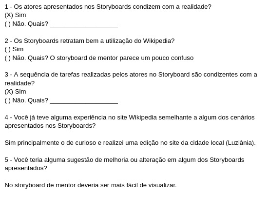

# Relato de Resultados da Avaliação do Storyboard

## Introdução

O relatório dos resultados da avaliação do "StoryBoard" é um artefato importante que tem o propósito de documentar minuciosamente os resultados obtidos através de uma avaliação meticulosa. O presente documento apresenta detalhadamente o relato de desempenho da avaliação dos "Storyboards", fornecendo informações substanciais sobre os resultados alcançados durante o processo.

### Os objetivos e escopo da avaliação

A avaliação dos Storyboards tem como objetivo verificar se as tarefas representadas em cada storyboard correspondem à experiência que o usuário tem durante sua rotina na plataforma Wikipedia. Além disso, busca-se analisar as áreas que podem ser aprimoradas e as críticas feitas pelos usuários, visando aperfeiçoar os storyboards.

- identificar problemas na interação;
- analisar a apropriação da tecnologia;

### Método de avaliação empregado

Usamos a metodologia de entrevista semiestruturada seguindo o [planejamento](relatoDosResultadosStoryBoard.md). O participante foi escolhido pensando na representatividade do público-alvo. Durante as entrevistas, o participante analisou os storyboards e foi dado feedback sobre a usabilidade e experiência do usuário. Os dados foram analisados qualitativamente, buscando padrões e pontos problemáticos. A metodologia permitiu uma avaliação abrangente, resultando em uma visão mais ampla para a construção de para melhorias no sistema.

| Data       | Horário | Local | Entrevistador                                | Entrevistado | Termo de consetimento                                                            |
| ---------- | ------- | ----- | -------------------------------------------- | ------------ | -------------------------------------------------------------------------------- |
| 28/05/2023 | 19:41   | TEAMS | Chaydson Ferreira e Pedro Henrique Rodrigues | Yan Werlley  | [Termo de consentimento](../../../pdfs/termoConsentimentoStoryBoardAssinado.pdf) |

    
 Tabela 1: Metadados da entrevista (Fonte: Autores. 2023).

### Sumário dos dados coletados

#### Gravação da entrevista

Na terça-feira, dia 28 de maio de 2023, a entrevista com o usuário, encontrado no vídeo 2, foi conduzido de forma remota no TEAMS com a participação dos entrevistadores Pedro e Chaydson e o entrevistado Yan Werlley.

<iframe width="560" height="315" src="https://www.youtube.com/embed/M0xHdzl_24I" title="YouTube video player" frameborder="0" allow="accelerometer; autoplay; clipboard-write; encrypted-media; gyroscope; picture-in-picture; web-share" allowfullscreen></iframe>

Video 1: Gravação da entrevista com usuário. (Fonte: Autores. 2023).

#### Respostas das perguntas adicionais

A imagem apresentada na Figura 1 representa as respostas do usuário entrevistado.

Figura 1: Perguntas respondidas pelo usuário.(Fonte: Autores. 2023).

### Análise e interpretação dos dados coletados

Com base nas respostas fornecidas, parece que os atores apresentados nos storyboards são consistentes com a realidade e que a sequência de tarefas realizadas pelos atores no storyboard também é consistente com a realidade. No entanto, há algum feedback de que o storyboard para o uso do mentor do Wikipedia é um pouco confuso e poderia ser melhorado para ser mais fácil de visualizar. Além disso, o usuário teve uma experiência pessoal semelhante a um dos cenários apresentados nos storyboards, especificamente o cenário curioso em que eles fizeram uma edição na página da Wikipedia da cidade local (Luziânia).

### Listagem dos problemas de usabilidade encontrados e Planejamento do reprojeto do sistema.

Com base nas respostas fornecidas, parece que os atores apresentados nos storyboards são consistentes com a realidade e que a sequência de tarefas realizadas pelos atores no storyboard também é consistente com a realidade. No entanto, há algum feedback de que o storyboard para o uso do mentor do Wikipedia é um pouco confuso e poderia ser melhorado para ser mais fácil de visualizar. Em termos de problemas encontrados e sugestões para melhoria, parece que o principal problema é com o storyboard do mentor sendo um pouco confuso e difícil de visualizar. Uma sugestão para melhoria seria tornar este storyboard mais fácil de entender e visualizar.

| Problema                                               | Onde se manifestou | Sugestão de melhoria                                                                                                              | Quem irá executar a refatoração |
| ------------------------------------------------------ | ------------------ | --------------------------------------------------------------------------------------------------------------------------------- | ------------------------------- |
| Tarefa de contatar mentor é confusa de ser visualizada | Contatar um mentor | O storyboard de contatar mentor deve ter desenhos maiores e mostrar mais a tela do computador para se saber como ele faz a tarefa | Gabriel                         |

## Bibliografia

BARBOSA, Simone; DINIZ, Bruno. Interação Humano-Computador. Editora Elsevier, Rio de Janeiro, 2010.

## Histórico de Versão

| Versão | Data       | Descrição                                                                | Autor(es)        | Revisor(es)      |
| ------ | ---------- | ------------------------------------------------------------------------ | ---------------- | ---------------- |
| 1.0    | 28/05/2023 | Criação do documento                                                     | Chaydson e Pedro | Lucas e Ana      |
| 1.1    | 28/05/2023 | Teste piloto                                                             | Lucas e Ana      | Chaydson e Pedro |
| 1.2    | 19/06/2023 | Aplicando correções da verificação                                       | Chaydson e Pedro | Lucas e Ana      |
| 1.3    | 05/07/2023 | Aplicando correções do relato com base na reestruturação do planejamento | Chaydson e Pedro | Lucas e Ana      |
