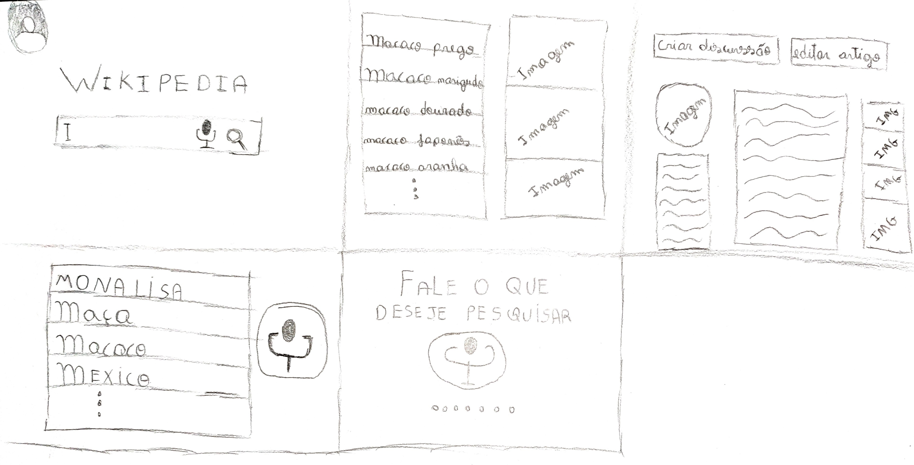
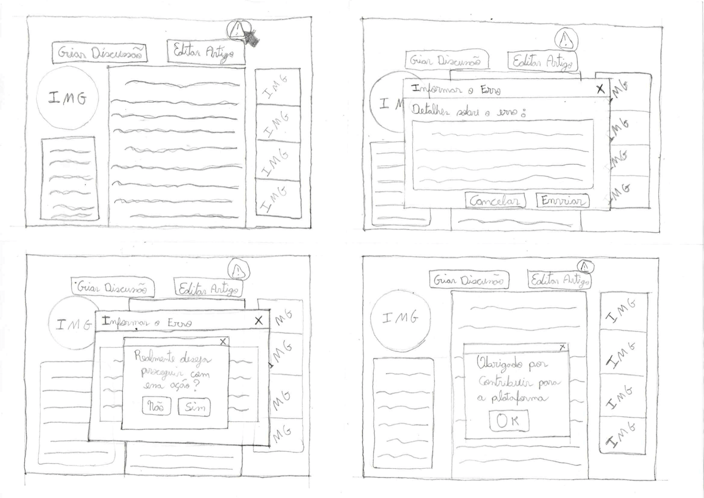
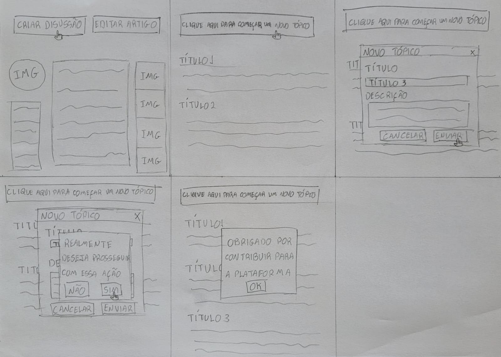
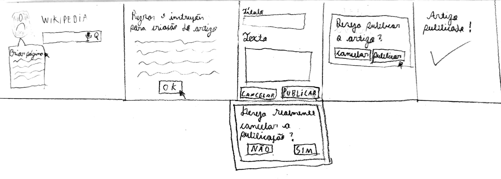
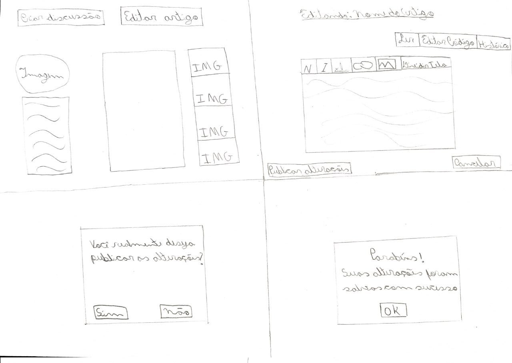
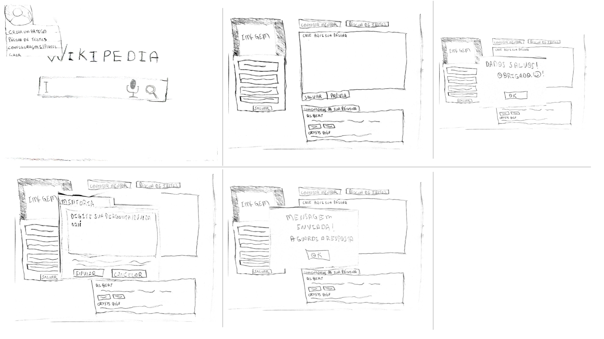

## Introdução

Neste artefato se encontram os prótotipos de papéis realizados pelo grupo.

## Prótotipo de Papel

O prótotipo de papel está utilizando os fluxos identificados durante a pesquisa documental e questionário no [perfil de usuário](../../../analise-de-requisitos/perfilDeUsuario.md) e seu posterior refinamento nas Análises de Tarefas [AHT](../../../analise-de-requisitos/aht.md) e [GOMS](../../../analise-de-requisitos/goms.md) e posteriormente refinadas dessa análise. Os fluxos que serão prototipados para se realizar a avaliação são 6, baseando na atividades contidas na Análise de Tarefas de [AHT](../../../analise-de-requisitos/aht.md) e [GOMS](../../../analise-de-requisitos/goms.md), contidos na Tabela 2

| Número | Tarefa                                  | Rastro                                         |
| ------ | --------------------------------------- | ---------------------------------------------- |
| 1      | Edição de um artigo                     | [AHT](../../../analise-de-requisitos/aht.md)   |
| 2      | Criação de um artigo no Wikipédia       | [GOMS](../../../analise-de-requisitos/goms.md) |
| 3      | Realização de uma pesquisa na Wikipédia | [GOMS](../../../analise-de-requisitos/goms.md) |
| 4      | Informar um erro                        | [GOMS](../../../analise-de-requisitos/goms.md) |
| 5      | Contatar um Mentor                      | [GOMS](../../../analise-de-requisitos/goms.md) |
| 6      | Criar uma discussão sobre artigo        | [GOMS](../../../analise-de-requisitos/goms.md) |

    
 Tabela 2: Fluxos a serem prototipadas (Fonte: Autores. 2023).

### Realizar uma pesquisa

Na Figura 1, apresentamos um protótipo em papel da tarefa de pesquisar um artigo na Wikipédia, existe também dois fluxos, um onde o usuário pesquisa por voz e o outro que digita.

Com esse novo design, propomos um design mais minimalista e agrádavel ao usuário.

Como as outras tarefas se derivam de uma pesquisa a um artigo, esse prototipo será a base para as outras tarefas.

Figura 1: Protótipo de baixa fidelidade do fluxo pesquisar um artigo.(Fonte: Lucas. 2023).

### Informar um erro

Na Figura 2 a seguir, apresentamos um protótipo em papel que mostra como informar um erro em artigos da Wikipédia.

Figura 2: Protótipo de baixa fidelidade do fluxo de informar erro.(Fonte: Pedro. 2023).

### Criar discussão sobre artigo

Na Figura 3 apresentamos um protótipo de papel que indica como criar uma discussão sobre artigo na WIkipédia.

Figura 3: Protótipo de baixa fidelidade do fluxo de criar discussão de artigo.(Fonte: Ana. 2023).

### Criar um artigo

Na Figura 4, apresentamos um protótipo de papel que indica como criar um artigo na Wikipédia.

Figura 4: Protótipo de baixa fidelidade do fluxo de criar um artigo.(Fonte: Samuel. 2023).

### Editar Artigo

Na Figura 5, está representado o protótipo de papel referente a edição de um artigo na Wikipédia.

Figura 5: Protótipo de baixa fidelidade do fluxo de editar um artigo.(Fonte: Chaydson. 2023).

### Contatar mentor

Na Figura 6, está representado o protótipo de papel referente a contatar um mentor na Wikipédia.

Figura 6: Protótipo de baixa fidelidade do fluxo de contatar mentor.(Fonte: Gabriel. 2023).

## Histórico de Versão

| Versão | Data       | Descrição            | Autor(es) | Revisor(es) |
| ------ | ---------- | -------------------- | --------- | ----------- |
| 1.0    | 05/07/2023 | Criação do documento | Lucas     | Gabriel     |
