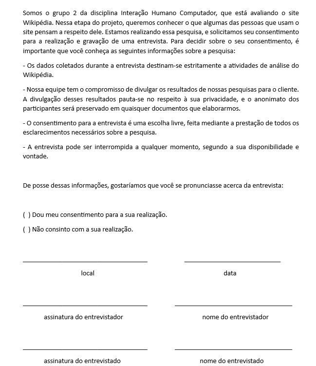

# Planejamento da Avaliação do Protótipo de Papel

## Introdução

Os protótipos desempenham um papel fundamental ao permitir que usuários e partes interessadas interajam com um produto em fase de concepção. Essa prática é extremamente útil para coletar feedback sobre pontos positivos e negativos relacionados a funcionalidades específicas ou ao produto como um todo.

A utilização de protótipos de alta fidelidade apresenta vantagens e desvantagens, dentre as vantagens ressaltam-se a interatividade completa do usuário com o protótipo, análise do design, esclarecimento de requisitos e realização de testes iniciais sobre a interface da aplicação. Em contrapartida, a elaboração de protótipos de alta fidelidade tem um custo maior, demanda mais tempo e não serve para coletas de requisitos. Ou seja, a prototipação de alta fidelidade deve ser aplicada nas etapas mais avançadas do design, pois não serve para coleta de requisitos.

Neste artefato será apresentado o planejamento da avaliação do protótipo de alta fidelidade realizado pela equipe.

## Metodologia

O planejamento seguirá o framework DECIDE, que consiste em seis etapas representadas pelas letras da palavra. A tabela 1 mostra o que cada letra significa.

| Componente | Descrição                                                     |
| :--------: | ------------------------------------------------------------- |
|   **D**    | Determinar os objetivos da avaliação de IHC.                  |
|   **E**    | Explorar perguntas a serem respondidas com a avaliação.       |
|   **C**    | Escolher (Choose) os métodos de avaliação a serem utilizados. |
|   **I**    | Identificar e administrar as questões práticas da avaliação.  |
|   **D**    | Decidir como lidar com as questões éticas.                    |
|   **E**    | Avaliar (Evaluate), interpretar e apresentar os dados.        |

    
 Tabela 1: Framework DECIDE (Fonte:Barbosa, Silva, Silveira, et al. 2021).

## D - Determinar os objetivos

O objetivo desta avaliação é compreender se aspectos do protótipo estão sendo bem implementados. Buscamos obter uma lista de feedback proveniente de usuários reais, com isso, iremos buscar responder as perguntas que foram elaboradas com base no livro da Simone(2021):

- Avaliar a usabilidade do protótipo de alta fidelidade;

- Identificar problemas na interação e interface.

## E - Explorar Perguntas Respondidas com a Avaliação

O objetivo deste planejamento da avaliação é responder às seguintes perguntas, que foram elaboradas com base no livro da Simone(2021):

- O usuário consegue operar o sistema?

- Ele atinge seu objetivo? Com quanta eficiência? Em quanto tempo? Após cometer quantos erros?

- Que parte da interface e da interação o deixa insatisfeito?

- Que parte da interface o desmotiva a explorar novas funcionalidades?

- Ele entende o que significa e para que serve cada elemento de interface?

- Ele vai entender o que deve fazer em seguida?

## C - Escolher os métodos de avaliação a serem utilizados.

A avaliação será feita por meio do métodos de investigação e observação, que consiste em entrevistar e observar os usuários interagindo com o protótipo.

O registro e a análise dos dados coletados permitem identificar problemas reais que os participantes enfrentaram, e não apenas problemas potenciais previstos pelo avaliador como em uma avaliação por inspeção. 

Esse método foi escolhido porque permite obter muitas informações e fazer perguntas que exploram os objetivos dos usuários. Além disso, a entrevista deverá ser gravada e documentada no [relato](relatoPrototipoAltaFidelidade.md).

## Cronograma

Pensando-se nas atividades a serem realizadas para a conclusão, um cronograma é necessário para se cumprir essa atividade de avaliação, tal cronograma está contido na Tabela 1

| Passos | Descrição                                      | Data          | Local( em caso de reunião) | Realizador(es)                             | Revisor(es)                               |
| ------ | ------------------------------------------------ | ------------- | --------------------------- | ------------------------------------------ | ----------------------------------------- |
| 1      | Desenvolvimento do Prótipo de Alta Fidelidade | 12/06 a 17/06 | Sem necessidade             | Ana,Chaydson,Gabriel,Lucas, Samuel e Pedro | Ana,Chaydson,Gabriel,Lucas, Samuel e Pedr |
| 2      | Teste Piloto                                     | 18/06         | Teams ou Google Meet        | Gabriel e Samuel                           | Lucas                                     |
| 3      | Teste de usabilidade                          | 19/06         | Teams ou Google Meet        | Ana e Lucas                                | Pedro                                     |
| 4      | Teste de usabilidade                          | 19/06         | Teams ou Google Meet        | Pedro e Chaydson                           | Gabriel                                   |
| 5      | Interpretação dos Dados e Possíveis Melhorias | 20/06 a 21/06 | Teams                       | Gabriel e Samuel                           | Chaydson e Lucas                          |

    
 Tabela 1: Cronograma da avaliação do protótipo de alta fidelidade (Fonte: Autores. 2023).

O passo 5 da tabela 1, está relacionado ao relato do resultados da Etapa 7 a ser realizada, como descrito no [cronograma planejado do projeto](../../../planejamento/cronogramaPlanejado.md) realizado anteriormente. Nas partes descritas 'Sem necessidade', no caso da Tabela 1, o local, se refere que as atividades não serão feitas em alguma plataforma de reuniões, mas sim pelos próprios membros fora de reuniões.

## Ferramentas Utilizadas

As ferramentas utilizadas para a reunião da entrevista será utlizada o Teams para usuários que possuem conta no mesmo, e o Google Meet, caso o usuário não tenha uma conta com possibilidade de acesso ao Teams. Sendo, os prótotipos, desenvolvidos utilizando a ferramenta Figma, que é um editor gráfico de vetor e prototipagem de projetos de design.

## Prótotipo de Alta Fidelidade

O prótotipo de papel está utilizando os fluxos identificados durante a pesquisa documental e questionário no [perfil de usuário](../../../analise-de-requisitos/perfilDeUsuario.md) e seu posterior refinamento nas Análises de Tarefas [AHT](../../../analise-de-requisitos/aht.md) e [GOMS](../../../analise-de-requisitos/goms.md) e posteriormente refinadas dessa análise. Os fluxos que serão prototipados para se realizar a avaliação são 6, baseando na atividades contidas na Análise de Tarefas de [AHT](../../../analise-de-requisitos/aht.md) e [GOMS](../../../analise-de-requisitos/goms.md), contidos na Tabela 2

| Número | Tarefa                                     | Rastro                                      |
| ------- | ------------------------------------------ | ------------------------------------------- |
| 1       | Edição de um artigo                      | [AHT](../../../analise-de-requisitos/aht.md)   |
| 2       | Criação de um artigo no Wikipédia       | [GOMS](../../../analise-de-requisitos/goms.md) |
| 3       | Realização de uma pesquisa na Wikipédia | [GOMS](../../../analise-de-requisitos/goms.md) |
| 4       | Informar um erro                           | [GOMS](../../../analise-de-requisitos/goms.md) |
| 5       | Contatar um Mentor                         | [GOMS](../../../analise-de-requisitos/goms.md) |
| 6       | Criar uma discussão sobre artigo          | [GOMS](../../../analise-de-requisitos/goms.md) |

    
 Tabela 2: Fluxos a serem prototipadas (Fonte: Autores. 2023).

## Teste de Usabilidade

Para o teste de usabilidade o primeiro passo é definir quem vai realizá-lo. É de extrema importância que os participantes tenhasm o mesmo perfil de usuário dos usuários do site Wikipédia. Esses perfis foram definidos na [página de perfil de usuário](../../../analise-de-requisitos/perfilDeUsuario.md).

### Termo de consentimento

No termo de consentimento buscamos esclarecer os objetivos do teste de usabilidade, solicitar explicitamente o consentimento do participante e informar dados sobre a pesquisa. O termo de consentimento, apresentado na figura 1, será aplicado no início da entrevista, antes de qualquer atividade, para que o participante tenha ciência do que será feito e possa decidir se quer ou não participar.

Figura 1: Termo de Consentimento, versão 1.(Fonte: Autores. 2023).

### Questões práticas

A preparação para a avaliação consiste em:

- Definir tarefas para os participantes executarem
- Definir o perfil dos participantes e recrutá-los
- Preparar material para observar e registrar o teste
- Executar um teste piloto

As seguintes subseções apresentam o planejamento prático das atividades.

Antes de iniciar a coleta de dados, o avaliador deve preparar o material de apoio, que consiste nos seguintes documentos:

- Termo de consentimento (duas vias, uma para o avaliador e uma para o participante)
- Especificação das tarefas e orientações para o usuário (apenas uma via)

Antes de iniciar a avaliação, o avaliador deve deixar claro para o usuário o que é o protótipo, podendo utilizar o texto abaixo como contextualização.

Um protótipo de alta fidelidade apresenta elementos e materiais que serão encontrados na versão final de um produto, assemelhando-se bastante ao produto final. A utilização de protótipos facilita a comunicação entre os membros da equipe e os stakeholders, além de auxiliar a equipe de desenvolvimento a tomar decisões de design.

### Papéis dos Avaliadores

Durante o teste, um membro do grupo exercerá o papel de avaliador. Ele ficará responsável por observar os comportamentos, comunicação não verbal e respostas do entrevistado, enquanto conduz a entrevista. Outro membro será responsável por explicar como será conduzido o teste de usabilidade e ajudar o participante no que precisar.

## Teste piloto

No Video 1, encontra-se a gravação do teste piloto realizado pelos membros Gabriel e Samuel. A tabela 3 descreve os detalhes do teste piloto. No qual, após realizado não foi identificado nada que possa alterar os resultados.

| Local | Participantes    | Data e hora          |
| ----- | ---------------- | -------------------- |
| Teams | Gabriel e Samuel | 24/06/2023 às 22:51 |

    
 Tabela 3: Realização do teste piloto (Fonte: Gabriel e Samuel. 2023).

## Conclusão

Essa página apresenta o planejamento da avaliação do protótipo de papel. O avaliador pode seguir o que está descrito e fazer alterações caso haja necessário.

## Bibliografia

BARBOSA, Simone; DINIZ, Bruno. Interação Humano-Computador. Editora Elsevier, Rio de Janeiro, 2010.

## Histórico de Versão

| Versão | Data       | Descrição            | Autor(es)            | Revisor(es) |
| ------- | ---------- | ---------------------- | -------------------- | ----------- |
| 1.0     | 12/06/2023 | Criação do documento | Ana e Chaydson | Pedro e Samuel       |
| 1.1     | 05/07/2023 | Corrigindo o DECIDE | Ana e Chaydson |        |
