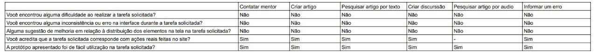
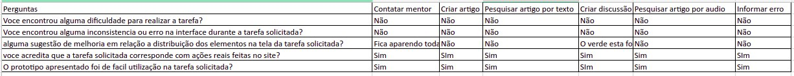

# Relato dos Resultados do Protótipo de Alta Fidelidade

## Introdução

Este documento tem como objetivo relatar os resultados da avaliação planejada no [Planejamento da avaliação](./planejamentoAvaliacaoPrototipoAltaFidelidade.md) e está seguindo como base o artefato do [Planejamento do relato](../planejamentoRelatoResultadosAvaliacaoPrototipoDeAltaFidelidade.md).

## Objetivos da Avaliação

O objetivo do documento é reunir as informações e extrair dados a partir das entrevistas realizadas, para definir se os protótipos de de alta fidelidade fazem sentido e com o teste de usabilidade feito com usuários atendem necessidades desses mesmos.

## Metodologia

Antes de cada entrevista foi apresentado ao entrevistado o propósito daquela entrevista, e que atividades ele iria ver e verificar se as mesmas fazem sentido, dando sua expressa opinião sobre problemas que o mesmo poderia encontrar durante a realização daquelas atividades, para logo em seguida, citar que um termo foi enviado ao email de preferência do mesmo para confimar que entendeu o objetivo da mesma. Sobre o que foi realizado, primeiro foi pedido para realizar o fluxo de criação de artigo, depois contatar mentor, depois o de editar um artigo, depois de informar um erro e por último de criar uma discussão, todos tentando seguir o fluxo mais natural possível para se dominar o uso do wikipédia. Através dessa observação da exploração do usuário e possíveis comentários sobre ressalvas de fluxos que o mesmo discorda e acha que podem melhorar é esperado concluir com solidez a obtenção e entedimento dos dados.

Os fluxos que serão analisados estão contidos na Tabela 2 do [planejamento da avaliação do protótipo de alta fidelidade](../planejamentoRelatoResultadosAvaliacaoPrototipoDeAltaFidelidade.md) o que no total somam 6 fluxos a serem representados por completo, caso um não esteja completo ele não será apresentado.

## Avaliadores e Participantes

A Tabela 1 contém os participantes da entrevista 1, que ocorreu no dia 25 de junho de 2023 às 11:09 no horário de brasília.

| Nome           | Função      |
| -------------- | ------------- |
| Ana Luiza      | Entrevistador |
| Lucas Lopes    | Entrevistador |
| Henrique Pucci | Entrevistado  |

    
 Tabela 1: Participantes da entrevista 1

A Tabela 2 contém os participantes da entrevista 2, que ocorreu no dia 25 de junho de 2023 às 20:23 no horário de brasília.

| Nome              | Função      |
| ----------------- | ------------- |
| Pedro Henrique    | Entrevistador |
| Chaydson Ferreira | Entrevistador |
| Yan               | Entrevistado  |

    
 Tabela 2: Participantes da entrevista 2

## Protótipo

<iframe style="border: 1px solid rgba(0, 0, 0, 0.1);" width="800" height="450" src="https://www.figma.com/embed?embed_host=share&url=https%3A%2F%2Fwww.figma.com%2Fproto%2FppVu27Rf6XW6Fxe32t4Hhp%2FIHC---Prototipos-team-library%3Ftype%3Ddesign%26node-id%3D2015-135%26scaling%3Dmin-zoom%26page-id%3D2015%253A134%26starting-point-node-id%3D2015%253A135%26show-proto-sidebar%3D1%26mode%3Ddesign" allowfullscreen></iframe>

    
 Figma 1: Protótipo de Alta Fidelidade 

O protótipo de alta fidelidade localizado no figma 01, apresenta os possíveis fluxos que o usuário irá realizar durante a entrevista

## Sumário dos Dados

<iframe width="560" height="315" src="https://www.youtube.com/embed/LTUybehLmsM" title="YouTube video player" frameborder="0" allow="accelerometer; autoplay; clipboard-write; encrypted-media; gyroscope; picture-in-picture; web-share" allowfullscreen></iframe>

    
 Entrevista 1: Entrevista com Henrique (Fonte: Ana e Lucas. 2023).

A entrevista 1 realizada com Henrique Pucci, o usuário gostou das atividades e não encontrou dificuldades na realização das atividades propostas, o que gerou poucos ou nenhum comentários sobre problemas encontrados.

<iframe width="560" height="315" src="https://www.youtube.com/embed/FtFd7W3rnsI" title="YouTube video player" frameborder="0" allow="accelerometer; autoplay; clipboard-write; encrypted-media; gyroscope; picture-in-picture; web-share" allowfullscreen></iframe>

    
 Entrevista 2: Entrevista com Yan (Fonte: Chaydson e Pedro. 2023).

A entrevista 2 realizada com Henrique, apesar de saber as atividades e conseguir realizar o fluxo com certa facilidade, o mesmo apresenta algumas ressalvas quanto há criar artigo e informar erro, os quais, essas ressalvas serão melhor desenvolvidas na seção de problemas encontrados.

### Respostas do Entrevistado

    
 Figura 1: Perguntas da Entrevista 1 (Fonte: Autores. 2023).

### Respostas do Entrevistado 2

    
 Figura 2: Perguntas da Entrevista 2 (Fonte: Autores. 2023).

A entrevista 2 realizada com Yan, apesar de saber as atividades e conseguir realizar o fluxo com certa facilidade, o mesmo apresenta algumas ressalvas quanto há criar artigo e informar erro, os quais essas ressalvas serão melhor desenvolvidas na seção de problemas encontrados.

### Termos de Consentimentos

As entrevistas foram realizadas levando em consideração [aspectos éticos](../../../analise-de-requisitos/aspectosEticos.md) pré-definidos anteriormente, sendo utilizadas Entrevista 1 e Entrevista 2, gerando os termos: [Termo da Entrevista 1](../../../pdfs/TermoDeConsentimentoAltaFidelidadeYan.pdf) e [Termo da Entrevista 2](../../../pdfs/TermoDeConsentimentoAltaFidelidadeHenrique.pdf)

## Análise e Intepretação dos Dados

O protótipo de alta fidelidade foi facilmente entendido pelos usuários, fornecendo uma experiência fácil de entender ao longo dos fluxos de interação, de acordo com as análise dos dados coletados das entrevistas. A conclusão de todas as tarefas propostas foi significativamente facilitada como resultado disso. Os participantes da pesquisa disseram que o protótipo demonstrou claramente sua funcionalidade e propósito, permitindo que eles usassem o sistema rapidamente e sem problemas. O protótipo deu aos usuários uma sensação de segurança e confiança durante as interação, o que tornou o processo mais simples e eficaz. Essas descobertas mostram que o desenvolvimento do protótipo de alta fidelidade foi bem-sucedido ao garantir uma experiência de usuário fácil de entender e acessível, promovendo uma conclusão eficaz de todas as tarefas propostas.

- O usuário consegue operar o sistema?
  Resposta: Sim, o usuário consegue se localizar no sistema com certa facilidade, já que os elementos se presentes na tela diminuíram o suficiente para o mesmo conseguir realizar a atividade iria querer.
- Ele atinge seu objetivo? Com quanta eficiência? Em quanto tempo? Após cometer quantos erros?

  Resposta: Os usuários conseguiram realizar as atividades pretentidas com sucesso, está localizada qual a atividade o tempo que os mesmos levaram para concluírem e se precisaram de ajuda ou não.
- Que parte da interface e da interação o deixa insatisfeito?

  Resposta: As partes da interface que deixaram os usuários insastifeitos foram tópicos relacionados ao menu superior, por não fechar ao tirar o mouse de cima e relacionados a página de discussão que possui um botão verde que chama atenção de mais e parece muito diferente do padrão do site.
- Que parte da interface o desmotiva a explorar novas funcionalidades?

  Resposta:  A edição de artigos, foi algo que passou despercebido pelos usuários, o qual deveria ser uma das funcionalidades/tarefas que deveria ter certo destaque.
- Ele entende o que significa e para que serve cada elemento de interface?

  Resposta: O usuário entende com quais elementos ele pode interagir, esses mesmo estão em um formato(retângular) que os deixa fácil de identificar onde é possível clicar, ou algum palavra sublinhada que fica bem-destacada, mas qe não atrapalha a leitura, por esse motivo, é perceptível que entende os elementos apresentados por terem esse destaque.
- Ele vai entender o que deve fazer em seguida?

  Resposta: Sim,  ele consegue entender, de acordo com as atividades passadas, foi explicado e/ou falado, antes e durante a entrevista quais as tarefas deveriam ser realizadas, dessa maneira o usuário poderia seguir as tarefas qee o mesmo desejar ou seguir na ordem em que foi citado para o mesmo sem nenhum problema.

## Problemas Identificados

A partir das entrevistas 1 e 2, foi possível verificar que a protótipação possui alguns pontos a serem melhorados, sendo eles:

- O menu drop-down não fechar ao tirar o mouse de cima.
- A cor de um botão está fora de sintonia com o resto do site.

## Sugestões de Correção

As sugestões de correção são:

- Fechar o menu drop-down ao tirar o cursor do mouse de cima.
- Achar uma cor apropriada para o botão que está fora de sintonia.
- Diminuir tamanho do menu
- Adicionar botão de X nos popups

## Bibliografia

Barbosa, S. D. J.; Silva, B. S. da; Silveira, M. S.; Gasparini, I.; Darin, T.; Barbosa, G. D. J. (2021). Interação Humano-Computador e Experiência do usuário. Autopublicação. ISBN: 978-65-00-19677-1.

Lichess. Disponível em: https://interacao-humano-computador.github.io/2022.2-Lichess/. Acesso em 26 de junho de 2023.

## Histórico de Versão

| Versão | Data       | Descrição            | Autor(es)        | Revisor(es)       |
| ------- | ---------- | ---------------------- | ---------------- | ----------------- |
| 1.0     | 26/06/2023 | Criação do documento | Gabriel e Samuel | Chaydson e Lucas |
| 1.1     | 05/07/2023 | Revisão de texto      | Gabriel          | ---               |
