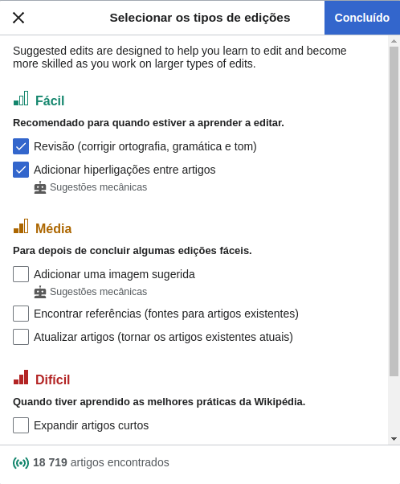

# Site escolhido para o projeto da disciplina

## Introdução

Este artefato apresenda a avaliação heurística do site Wikipédia. Antes de realizar a avaliação foi utilizado o framework DECIDE para obter uma melhor estrutura da avaliação. As atividades do framework são interligadas e executadas iterativamente, à medida que o avaliador articula os objetivos da avaliação, os dados e recursos disponíveis. No método de avaliação será usada a avaliação heurística. Esse método de avaliação orienta os avaliadores a inspecionar sistematicamente a interface em busca de problemas que prejudiquem a usabilidade. Por ser um método de inspeção, a avaliação heurística foi proposta como uma alternativa de avaliação rápida e de baixo custo, quando comparada a métodos empíricos. [1]

## Framework DECIDE

O Framework DECIDE é dividido em 6 etapas, que estão descritas na tabela 1. O site escolhido para ser avaliado é a Wikipedia (https://pt.wikipedia.org/). Se trata de uma enciclopédia online colaborativa e gratuita com milhões de artigos em diversos idiomas e tópicos, mantida pela Fundação Wikimedia.

Na Tabela 1 a seguir, são apresentados os componentes do framework DECIDE juntamente com seus respectivos significados. Posteriormente, é explicado como cada componente será aplicado no projeto.

| Componente | Descrição                                                      |
| :---------: | ---------------------------------------------------------------- |
| **D** | Determinar os objetivos da avaliação de IHC.                   |
| **E** | Explorar perguntas a serem respondidas com a avaliação.        |
| **C** | Escolher (Choose) os métodos de avaliação a serem utilizados. |
| **I** | Identificar e administrar as questões práticas da avaliação. |
| **D** | Decidir como lidar com as questões éticas.                     |
| **E** | Avaliar (Evaluate), interpretar e apresentar os dados.           |

    
 Tabela 1: Framework DECIDE (Fonte:Barbosa, Silva, Silveira, et al. 2021).

### Determinar os objetivos da avaliação

1. Identificar possíveis problemas de usabilidade do site, como dificuldades de navegação ou problemas de legibilidade.

2. Identificar possíveis problemas de acessibilidade, como a falta de compatibilidade com diferentes dispositivos e navegadores ou a falta de recursos para usuários com deficiência visual ou auditiva.

3. Analisar o site seguindo as heurísticas propostas por Nilsen.

<h3 id="perguntas"> Explorar perguntas a serem respondidas com a avaliação</h3>

1. Quais são os possíveis problemas de usabilidade e acessibilidade do site da Wikipedia que podem afetar a navegação ou a legibilidade para os usuários?

2. O site segue completamente todas as heurístcas propostas por Nilsen?

3. O site é fácil de usar?

4. O site é responsivo?

5. O site é acessível para diferentes usuários?

<h3 id="metodo"> Escolher (Choose) os métodos de avaliação a serem utilizados.</h3>

Como o objetivo é basicamente avaliar a usabilidade do site, o método escolhido foi a avaliação heurística que é uma abordagem que envolve a análise da interface com base em princípios heurísticos estabelecidos, como a consistência e feedback do sistema. Essa abordagem é mais adequada para avaliar a usabilidade geral da interface, identificar problemas de design e fornecer recomendações para melhorias. 

A avaliação heurística tem como base um conjunto de diretrizes de usabilidade,
que descrevem características desejáveis da interação e da interface, chamadas por
Nielsen de heurísticas. A seguir são apresentadas as heurísticas determinadas por Nilsen e seu devido conceito de acordo com Simone (2010):

**Visibilidade do estado do sistema:** o sistema deve sempre manter os usuários
informados sobre o que está acontecendo;

**Correspondência entre o sistema e o mundo real:** o sistema deve utilizar palavras, expressões e conceitos que são familiares aos usuários;

**Controle e liberdade do usuário:** A interface deve permitir que o usuário desfaça e refaça suas ações;

**Consistência e padronização:** O designer deve seguir as convenções da plataforma ou do ambiente computacional;

**Reconhecimento em vez de memorização:** As instruções de uso do sistema devem estar visíveis ou facilmente acessíveis sempre que necessário;

**Flexibilidade e eficiência de uso:** aceleradores podem tornar a interação do usuário mais rápida e eficiente, permitindo que o sistema consiga servir igualmente bem os usuários experientes e inexperientes;

**Projeto estético e minimalista:** a interface não deve conter informação que seja irrelevante ou raramente necessária;

**Prevenção de erros:** projeto cuidadoso que evite que um problema ocorra, caso isso seja possível;

**Ajude os usuários a reconhecerem, diagnosticarem e se recuperarem de erros:** as mensagens de erro devem ser expressas em linguagem simples, indicar precisamente o problema e sugerir uma solução
de forma construtiva;

**Ajuda e documentação:** é necessário oferecer ajuda e documentação de alta qualidade. Tais informações devem ser facilmente encontradas, focadas na tarefa do usuário, enumerar passos concretos a serem realizados e não ser muito extensas.

### Identificar e administrar as questões práticas da avaliação.

1. Recutar os avaliadores.

2. Quais são os equipamentos necessários para realizar a avaliação?

3. Os avaliadores têm os equipamentos adequados?

4. Os equipamentos estão funcionando?

### Decidir como lidar com as questões éticas.

É importante tomar cuidado com as questões éticas mesmo que não haja participantes externos ou usuários reais envolvidos na avaliação. Deve-se respeitar as pessoas envolvidas, esclarecer os objetivos da avaliação e garantir que os dados coletados não sejam divulgados de forma inadequada.

### Avaliar (Evaluate), interpretar e apresentar os dados.          

Cada dado da avaliação será analisado, interpretado e apresentado da melhor forma. Procurando seguir as perguntas descritas na etapa <a href= #perguntas>Explorar perguntas a serem respondidas com a avaliação</a> e o método escolhido na etapa <a href= #metodo> Escolher (Choose) os métodos de avaliação a serem utilizados. </a>

## Avaliação Heurística

### 1. Status do sistema

Não foram identificados problemas em relação a esse aspecto, uma vez que o site fornece informações relevantes ao usuário em tempo hábil, permitindo que ele compreenda o que está acontecendo.

### 2. Compatibilidade do sistema com o mundo real

A Wikipedia não atende corretamente a esta heurística em alguns casos, como na nomenclatura de alguns termos específicos, que podem não ser facilmente compreendidos por usuários iniciantes ou que não estejam familiarizados com os termos técnicos, como pode ser observado na Figura 1. Além disso, algumas interfaces podem não ser intuitivas o suficiente para o usuário, o que pode levar a confusão e erros de navegação.

    
 Figura 1: Compatibilidade do sistema com o mundo real, versão 1. (Fonte: Autores. 2023).

### 3. Controle do usuário e liberdade

Não foram identificados problemas em relação a esse aspecto, uma vez que o site fornece funções disponíveis que possibilitam saídas de funções indesejadas. O menu lateral está presente a todo momento garantindo uma boa navegabilidade.

### 4. Consistência e padrões

Foram encontrados problemas nessa heurística, pois o site não oferece um padrão de navegação e botoẽs ao longo de todas as páginas. Além disso, as páginas não possui um padrão de cores, o que pode confundir o usuário, como exemplificao na Figura 2.

    
 Figura 2: Tela fora do padrão, versão 1. (Fonte: Autores. 2023).

Abaixo na Figura 3 está a avaliação dessa heurística:

    
 Figura 3: Consistência e padrões, versão 1. (Fonte: Autores. 2023).

### 5. Prevenção de erros

Não foram encontrados problemas com relação a esse aspecto, pois o design do sítio está
adaptado para prevenir que usuários cometam erros ao colocar alguma entrada incorreta ao
utilizá-lo.

### 6. Reconhecimento ao invés de lembrança

Esse aspecto não apresentou problemas, pois o sistema mostra as informações necessárias para o seu funcionamento adequado no contexto em que o usuário está. Assim, o usuário não precisa memorizar nenhuma informação que estava em uma página anterior do mesmo site.

### 7. Flexibilidade e eficiência de uso

A Wikipedia atende à heurística Flexibilidade e eficiência de uso de Nielsen na tela "Selecionar tipo de edição" ao permitir que os usuários personalizem sua experiência, conforme exemplifica a Figura 4. Na tela, os usuários podem escolher entre a dificuldade da edição a ser feita, portanto abrangendo mais pessoas.

    
 Figura 4: Flexibilidade e eficiência de uso, versão 1. (Fonte: Autores. 2023).

### 8. Estética e design minimalista

A página "Páginas vigiadas" da Wikipedia não atende adequadamente a essa heurística, uma vez que a página é confusa visualmente e pode ser considerada poluída em termos de design, como mostrado na Figura 5. A interface contém muitos elementos diferentes, como caixas de seleção, botões e diversos menus, o que pode sobrecarregar a página e dificultar a navegação. No geral, a página "Páginas vigiadas" pode ser melhorada visualmente para torná-la mais esteticamente agradável e mais fácil de usar como é possível observar na imagem abaixo:

    
 Figura 5: Exemplo de tela fora que não atende a heurística, versão 1. (Fonte: Autores. 2023).

Segue a avaliação heurística dessa tela na Figura 6:
``

    
 Figura 6: Estética e design minimalista, versão 1. (Fonte: Autores. 2023).

### 9. Ajuda aos usuários no reconhecimento e diagnóstico e correção de erros

A tela de edição de páginas vigiadas na Wikipedia apresenta falhas na heurística de Ajuda aos usuários no reconhecimento e diagnóstico e correção de erros, conforme mostra a Figura 7. Isso porque, ao tentar editar uma página vigiada, o usuário não recebe uma mensagem de erro ao tentar fazer uma ação indevida. Isso pode dificultar a identificação do erro e a correção por parte do usuário, impactando negativamente na usabilidade da plataforma.

    
 Figura 7: Falha na ajuda aos usuários no reconhecimento , versão 1. (Fonte: Autores. 2023).

Segue a avaliação heurística dessa tela na Figura 8:

    
 Figura 8: Ajuda aos usuários no reconhecimento e diagnóstico e correção de erros, versão 1. (Fonte: Autores. 2023).

### 10. Ajuda e documentação

A Wikipedia atende corretamente à heurística Ajuda e Documentação de Nielsen ao fornecer uma ampla variedade de recursos de ajuda e documentação para seus usuários, exemplificado pela Figura 9. O site possui uma seção de ajuda abrangente que aborda uma variedade de tópicos, desde como editar uma página até como criar uma nova página. Além disso, a Wikipedia oferece um guia de edição que fornece orientações detalhadas sobre como criar e editar conteúdo. Há também fóruns de discussão e uma comunidade ativa de editores que estão disponíveis para responder a perguntas e fornecer suporte aos usuários. Todos esses recursos ajudam a garantir que os usuários da Wikipedia possam encontrar ajuda e suporte quando precisam.

    
 Figura 9: Ajuda e documentação, versão 1. (Fonte: Autores. 2023).

## Referências Bibliográficas

[1] Barbosa, S. D. J.; Silva, B. S. da; Silveira, M. S.; Gasparini, I.; Darin, T.; Barbosa, G. D. J. (2021)
Interação Humano-Computador e Experiência do usuário. Autopublicação. ISBN: 978-65-00-19677-1.

## Histórico de Versão

| Versão | Data       | Descrição                                                 | Autor(es)                    | Revisor(es) |
| ------- | ---------- | ----------------------------------------------------------- | ---------------------------- | ----------- |
| 1.0     | 07/04/2023 | Criação do Documento                                      | Lucas                        | Gabriel     |
| 1.1     | 07/04/2023 | Heuristica 4, 5 e 6                                         | Lucas                        | Gabriel     |
| 1.3     | 22/04/2023 | Criação do texto do decide e as heurísticas que faltavam | Lucas, Pedro, Ana e Chaydson | Gabriel     |
| 1.4     | 28/04/2023 | Padronizando imagens da avaliação heurística             | Lucas                        | Grupo       |
| 1.5     | 05/07/2023 | Corrigindo DECIDE      | Ana                        |        |
