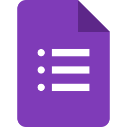
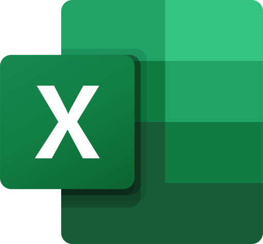

# Ferramentas

## Introdução

Bem-vindo à página de ferramentas do projeto! Aqui você encontrará uma lista de ferramentas e recursos que estamos utilizando no desenvolvimento do projeto. Essas ferramentas foram selecionadas para ajudar a maximizar a eficiência e a qualidade do projeto, tornando o processo de desenvolvimento mais ágil e eficaz. Cada ferramenta listada nesta página tem um propósito específico e irá desempenhar um papel importante em todo o processo.

## Ferramentas

A tabela a seguir, Tabela 1, apresenta todas as ferramentas utilizadas no projeto, bem como sua aplicação em cada etapa correspondente.

| Logo                                                                       | Ferramenta                 | Etapa                                                               | Descrição                                                                                                                                                                                                                                                                                                           |
| -------------------------------------------------------------------------- | -------------------------- | ------------------------------------------------------------------- | --------------------------------------------------------------------------------------------------------------------------------------------------------------------------------------------------------------------------------------------------------------------------------------------------------------------- |
| <figure></figure>   | GitHub                     | Todo o projeto                                                      | O GitHub é usado para hospedar o projeto em um repositório público.                                                                                                                                                                                                                                                |
|                          | Git                        | Todo o projeto                                                      | O Git é usado para controlar as versões do projeto.                                                                                                                                                                                                                                                                 |
|                     | Telegram                   | Todo o projeto                                                      | O Telegram é usado para a comunicação entre os colaboradores do projeto.                                                                                                                                                                                                                                           |
|                      | Discord                    | Todo o projeto                                                      | O Discord é usado para a comunicação por voz e texto entre os colaboradores do projeto.                                                                                                                                                                                                                            |
|                       | MkDocs                     | Todo o projeto                                                      | O MkDocs é usado para criar documentação de projetos em formato HTML ou outros formatos, a partir de arquivos em formato Markdown                                                                                                                                                                                  |
|               | MkDocs                     | Todo o projeto                                                      | O MkDocs Material é um tema de documentação para o MkDocs que oferece uma aparência moderna e responsiva para a documentação do projeto.                                                                                                                                                                       |
|                       | Teams                      | Todo o projeto                                                      | O Teams é um aplicativo web e app para realizar reuniões de pessoas desenvolvida pela microsoft, sendo utilizada no projeto como principal ferramenta para a reunião semanal e gravações                                                                                                                       |
|                | Officer Viewer             | Todo o projeto                                                      | O Officer Viewer(Markdown Editor) é uma extensão do Visual Studio Code utilizada para editar de maneira mais fácil documento com extensão  .md(markdown)                                                                                                                                                        |
|                  | Google Forms               | Análise de Requisitos   Design,Avalição e Desenvolvimento | O Google Forms é uma ferramenta de criação de formulários on-line gratuita oferecida pelo Google. Será utilizado para fazer questionários para a pesquisa de perfil de usuário do projeto, além de elaborar os termos de consentimento.                                                                       |
|                       | VsCode                     | Todo o projeto                                                      | O VsCode é usado para editar o código markdown que gera a página.                                                                                                                                                                                                                                                  |
|                      | YouTube                    | Todo o projeto                                                      | O YouTube é o site pelo qual o grupo hospeda as gravações.                                                                                                                                                                                                                                                         |
|                   | Lucidchart                 | Análise de Requisitos                                              | O Lucidchart é usado para fazer a diagramação e visualização de informações.                                                                                                                                                                                                                                   |
|                             | Excel                      | Planejamento                                                        | O Excel é um programa de planilha eletrônica desenvolvido pela Microsoft e é amplamente utilizado em ambientes profissionais e pessoais. Ele oferece uma ampla gama de recursos e funcionalidades que o tornam uma ferramenta versátil para realizar várias tarefas relacionadas a dados, cálculos e análises. |
|  | This Person Does Not Exist | Análise de Requisitos                                              | O This Person Does Not Exist é um aplicativo para geração de fotos de pessoas que não existem, o mesmo será utilizado para elaborar imagens de pessoas que não existem a fim de construir as personas do projeto.                                                                                               |
|                                      | Figma                      | Design,Avalição e Desenvolvimento                                 | O Figma é uma ferramenta de design de interface de usuário (UI) e prototipagem, que será utilizada para elaborar os protótipos de alta fidelidade do projeto.                                                                                                                                                     |

 Tabela 1: Ferramentas utilizadas durante o projeto (Fonte: Pedro, 2023). 

## Bibliografia

Build software better, together. Disponível em: [https://github.com/](https://github.com/). Acesso em: 22 abr. 2023.

‌Git. Disponível em: [https://git-scm.com/](https://git-scm.com/). Acesso em: 22 abr. 2023.

‌TELEGRAM FZ-LLC. Telegram. Disponível em: [https://play.google.com/store/apps/details?id=org.telegram.messenger&amp;hl=pt_BR&amp;gl=US](https://play.google.com/store/apps/details?id=org.telegram.messenger&hl=pt_BR&gl=US). Acesso em: 19 abr. 2023.

‌DISCORD. Seu Lugar para Papear e Ficar De Boa. Disponível em: [https://discord.com/](https://discord.com/). Acesso em: 19 abr. 2023.

TEAM, M. MkDocs. Disponível em: [https://www.mkdocs.org/](https://www.mkdocs.org/). Acesso em: 19 abr. 2023.

DONATH, M. Material for MkDocs. Disponível em: [https://squidfunk.github.io/mkdocs-material/](https://squidfunk.github.io/mkdocs-material/). Acesso em: 19 abr. 2023.

‌Microsoft Teams. Disponível em: [https://www.microsoft.com/pt-br/microsoft-teams/log-in](https://www.microsoft.com/pt-br/microsoft-teams/log-in). Acesso em: 19 abr. 2023.

‌Office Viewer(Markdown Editor) - Visual Studio Marketplace. Disponível em: [https://marketplace.visualstudio.com/items?itemName=cweijan.vscode-office](https://marketplace.visualstudio.com/items?itemName=cweijan.vscode-office). Acesso em: 19 abr. 2023.

‌MICROSOFT. Visual Studio Code. Disponível em: [https://code.visualstudio.com/](https://code.visualstudio.com/). Acesso em: 19 abr. 2023.

‌FRTTT, M. YouTube. YouTube, 2023. Disponível em: [https://www.youtube.com/](https://www.youtube.com/). Acesso em: 19 abr. 2023.

ThisPersonDoesNotExist - Random AI Generated Photos of Fake Persons. Disponível em: [https://this-person-does-not-exist.com/en](https://this-person-does-not-exist.com/en). Acesso em: 30 abr. 2023.

## Histórico de Versão

| Versão | Data  | Descrição                                               | Autor(es) | Revisor(es)    |
| ------ | ----- | ------------------------------------------------------- | --------- | -------------- |
| 1.0    | 03/04 | Criação do documento                                    | Pedro     | Lucas          |
| 1.1    | 22/04 | Adicionar referências                                   | Pedro     | Lucas          |
| 1.2    | 30/04 | Adicionando novas ferramentas                           | Lucas     | Pedro e Samuel |
| 1.3    | 30/04 | Aplicando correções apontadas na verificação            | Pedro     | Lucas          |
| 1.4    | 01/07 | Adição de ferramentas e onde serão usadas em cada etapa | Pedro     | Lucas          |
