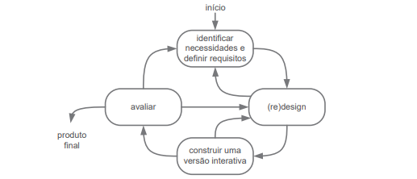
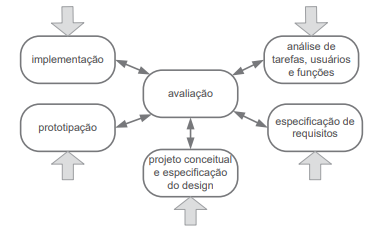
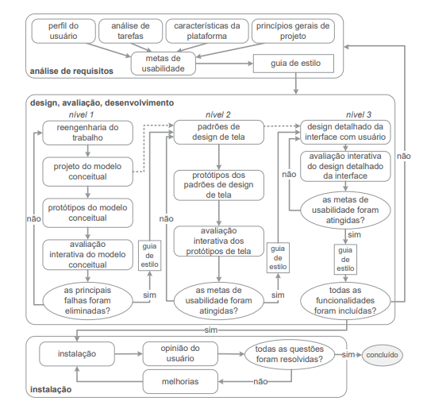

# Processo de Design

## Introdução

O processo de design é uma parte importante do desenvolvimento de um projeto de IHC (Interação Humano Computador), consistindo na execução organizada e iterativa de uma atividade de design em busca de conhecimento do problema e construção de solução(intervenção) para esse problema, sendo essas atividades de design dividas em:

- **Análise de Contexto** : Consiste no estudo e interpretação da situação atual
- **Síntese de Intervenção**: Planejar e executar intervenções(soluções) na situação presente
- **Avaliação da Nova situação** : Comparar os efeitos que a nova intervenção trouxe comparando-a com a intervenção anterior.

Essas atividades irão ser repetidas em iterações que refinarão o projeto, até que a proposta de intervenção esteja solucionando satisfatoriamente o problema para projeto de IHC, com essa atividade sistemática visando trazer a eficiência no desenvolvimento e conhecimento e produto e problema do projeto.

## Modelos de Ciclo de Vida

### Ciclo de Vida Simples

O Ciclo de Vida Simples é a construção de uma sequência genérica de atividades de design, na qual inicia-se o projeto identificando as necessidades e definindo os requisitos do produto para numa etapa seguinte o designer analisar e criar um esboço de como funcionará o sistema, caso seja satisfatório, o mesmo avança para a fase de gerar um protótipo interativo do esboço ou voltar a etapa anterior para adicionar a intervenção, pensando em caracteristicas que o designer não havia pensado anteriormente. Para a fase de construção de uma versão interativa, caso a intervenção esteja completada com sucesso ela vai para a etapa de avaliação, caso não, ela retorna a etapa anterior que é a de (re-)design. Após a avaliação, se a solução desenvolvida atende a necessidades e os requisitos identificados anteriormente o processo é finalizado e é dado um passo posterior ao processo de design para se desenvolver o sistema interativo. Caso não atenda, ele vai para  etapa de identificar necessidades e requisitos novamente ou a para a parte de (re-)design. Por ser muito simples, esse processo não é muito amigável com pessoas que estão aprendendo a realizar processos de design, por pular partes essenciais do desenvolvimento de design de IHC, fazendo com que pessoas que não conheçam o processo acabem por gerar artefatos essenciais ao processo de design. Na Figura 1 é apresentado o modelo simples.

    
 Figura 1: Modelo simples do processo de design(Fonte: Barbosa, S. D. J. 2021)

### Ciclo de Vida em Estrela

No Ciclo de Vida em Estrela, cabe ao designer definir em qual parte iniciar, como demonstrada por suas setas na Figura 2, não importantando muito a ordem em que ocorre, pois sempre irão passar pela etapa de avaliação que detectar problemas desde de a usabilidade até o sistema final. Essa etapa de avaliar o que foi desenvolvido reduz o custo que se poder ter mais para frente com retrabalho. A Figura 2 demonstra o fluxo do ciclo de vida em estrela.

    
 Figura 2 : Modelo de Ciclo de Vida em Estrela(Fonte: Barbosa, S. D. J. 2021)

### Engenharia de Usabilidade de Mayhew

A engenharia de Usabilidade de Mayhew é definida seu ciclo de vida em três etapas/fases que definem bem as características desse mesmo sendo elas a análise de requisitos , a fase de design, avaliação e desenvolvimento e por último a fase de instalação, como se pode ver na Figura 3, é um modelo de ciclo de vida bem detalhado do que se pode realizar

#### **Análise de Requisitos**

A Etapa/Fase de análise de requisitos consiste em definir certas atividades para se definir certas limitações, ações e condições em que o sistema funcionará tudo isso, sendo definido através de metas de usabilidades que serão definidas a partir das atividades de perfil de usuário, análise de tarefas(tarefas a serem realizadas), características da plataforma e principios gerais de projeto. As metas de usabilidade auxiliam na criação do guia de estilo que definem limites e padrões a serem utilizados no desenvolvimento do projeto. Tal análise pode ocorrer em cima de alguma plataforma já desenvolvida. Após o desenvolvimento dessa fase como vista na Figura 3, ocorre a próxima fase a de design, avaliação e desenvolvimento.

#### **Design, avaliação e desenvolvimento**

Essa fase consiste em três níves os quais definirão o andamento do projeto, no primeiro nível o designer irá validar por meio de documentação e criação de protótipos de baixa fidelidade e avaliação desses meios para a eliminação de falhas criticas ao sistema, enquanto essas falhas persistirem o mesmo não sairá desse nível, no nivel 2, é realizado a criação de padrões para design de telas e criação de prótotipos de média fidelidade que sigam esse padrão, prosseguindo para o último nível somente quando as metas de usabilidade que foram definidas ou redefinidas anteriormente foram atendidas. Na última fase, é desenvolvido um prótotipo de alta fidelidade simulando como seria o resultado final, a avaliação desse nível consiste na confirmação, se as metas de usabilidade e guia de estilo foram atendidos e seguidos confomre definido, caso não, o mesmo volta para a fase de análise. Todos esses passos devem ser avaliados com partipação de possíveis usuários do sistema, caso tudo tenha sido atendido, se prossegue para a última fase, a instalação.

#### **Instalação**

Na última fase, a de instalação, é realizada uma coleta de dados com base na opinião do usuário durante o tempo em que se usou o sistema, utilizando-se dessas informações para realizar melhorias quanto ao sistema ou planejar o desenvolvimento de novos sistemas interativos que não foram catálogados anteriomente, por esta em uma fase muito cedo do projeto. Dessa maneira encerra-se o ciclo de vida de Mayhew.

Figura 3: Modelo de Ciclo de Vida com uso engenharia da usabilidade(adaptado de Mayhew,1999)

### Engenharia de Usabilidade de Nielsen

A engenharia de Usabilidade de Nielsen consiste no uso de conjunto de atividades para definir uma espécie de passo a passo para o ciclo de vida de um produto/design, tais atividades e sub-atividades contém instruções do que se realizar para um bom ciclo de vida e para se criar uma intervação que solucionará o problema. As atividades são listadas na tabela 1.

| Número | Atividade                                           |
| :-----: | --------------------------------------------------- |
|    1    | Conheça seu usuário                               |
|    2    | Realize uma análise competitiva                    |
|    3    | Defina as metas de usabilidade                      |
|    4    | Faça designs paralelos                             |
|    5    | Adote o design participativo                        |
|    6    | Faça o design coordenado da interface como um todo |
|    7    | Aplique diretrizes e análise heurística           |
|    8    | Faça protótipos                                   |
|    9    | Realize testes empíricos                           |
|   10   | Pratique design iterativo                           |

    
 Tabela 1: Conjunto de Atividades de Nielsen.

## Ciclo de Vida Escolhido

Baseando-se na escolha e nas atividades desenvolvidas até o momento pelo grupo, o ciclo de vida escolhido foi o de Engenharia de Usabilidade Mayhew, tal ciclo foi escolhido devido a suas caracteríticas e processos,que são mais amigavéis para o desenvolvimento de projetos para pessoas que estão aprendendo, considerando tais pontos esssenciais para o grupo e para o desenvolvimento do projeto na matéria, e que se adequam ao que foi proposto pela disciplina e cronograma desenvolvido. Leva-se em conta também que apesar de escolher esse ciclo de vida, o grupo pode utilizar e adaptar o uso de outros modelos para obter resultados desejados, para a realização satisfatória do projeto, caso seja necessário.

## Bibliografia

Barbosa, S. D. J.; Silva, B. S. da; Silveira, M. S.; Gasparini, I.; Darin, T.; Barbosa, G. D. J. (2021)
Interação Humano-Computador e Experiência do usuário. Autopublicação. ISBN: 978-65-00-19677-1. Acesso em 23 de Abril de 2023.

## Histórico de Versão

| Versão | Data       | Descrição                           | Autor(es) | Revisor(es) |
| ------- | ---------- | ------------------------------------- | --------- | ----------- |
| 1.0     | 23/04/2023 | Documentação do Processo de Design  | Gabriel   | Ana Luiza   |
| 1.1     | 29/04/2023 | Correção de erros de digitação    | Chaydson  | Pedro       |
| 1.2     | 19/06/2023 | Ajustes de acordo com a verificação | Gabriel   | Pedro       |
