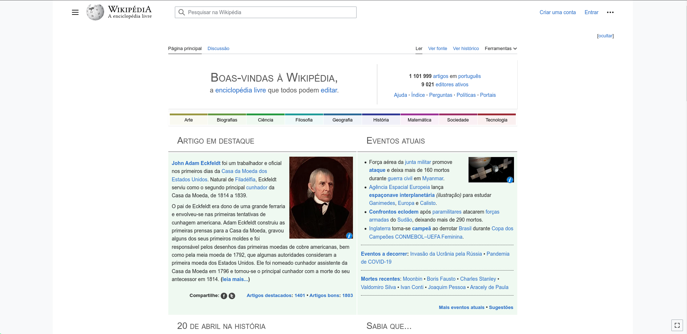

## Introdução

Bem-vindo à página de site escolhido! Aqui você encontrará mais detalhes sobre o site que foi escolhido para ser estudado na disciplina.

## Sobre o site escolhido

O site escolhido para estudo na disciplina foi a Wikipédia, uma plataforma que abriga artigos enciclopédicos sobre uma variedade de tópicos, escritos e editados por voluntários de todo o mundo. A Fundação Wikimedia é responsável pela manutenção do site, juntamente com outros projetos que promovem conteúdo livre, como o Wikcionário, Wikinotícias e Wikilivros. Desde seu lançamento em 2001, a Wikipédia acumula mais de 50 milhões de artigos em mais de 300 idiomas. Embora qualquer pessoa possa criar ou modificar um artigo na Wikipédia, é crucial seguir as regras de verificabilidade, neutralidade e respeito aos direitos autorais. A Wikipédia é uma fonte de informação popular e acessível, mas não é infalível e pode conter erros ou imprecisões.

## Por que o site da wikipédia foi escolhido?

O site da Wikipedia foi escolhido para estudo na disciplina devido à sua relevância como uma das maiores e mais conhecidas enciclopédias online, com milhões de artigos em diversos idiomas e por causa da sua interface, a Wikipedia pode ser considerada um exemplo de interface pouco amigável, uma vez que possui muita informação e pode ser difícil de navegar para usuários iniciantes. O estudo da Wikipedia pode fornecer importantes ideias sobre como identificar e melhorar problemas em interfaces que possuem uma grande quantidade de informações.

## Critérios de escolha

- Não foi estudado na disciplina
- Grande quatidade de usuários
- Muitas interações
- Interface pouco amigável

## Usuários do site

A Wikipédia é uma das maiores plataformas de conhecimento livre e colaborativo do mundo, com milhões de usuários ativos em todo o mundo. Esses usuários podem ser divididos em duas categorias principais: editores e leitores.

Os editores da Wikipédia são aqueles que criam, editam e atualizam o conteúdo da plataforma. Eles são os responsáveis por escrever os artigos, adicionar referências, corrigir erros e manter a qualidade e precisão das informações. Os editores da Wikipédia são voluntários e trabalham sem remuneração, movidos pelo desejo de compartilhar conhecimento e contribuir para a comunidade.

A Wikipédia possui uma comunidade global de editores, com usuários ativos em praticamente todos os países do mundo. Esses editores trabalham em uma ampla variedade de assuntos, desde ciência e tecnologia até história, cultura e artes. Alguns editores se especializam em áreas específicas, enquanto outros contribuem com uma ampla variedade de tópicos.

Os leitores da Wikipédia são aqueles que utilizam a plataforma para encontrar informações sobre uma ampla variedade de assuntos. Esses usuários podem ser estudantes, pesquisadores, profissionais ou simplesmente pessoas interessadas em aprender algo novo. A Wikipédia é acessível a todos e é uma fonte confiável de informação para muitas pessoas em todo o mundo.

Além dos editores e leitores, a Wikipédia também conta com um grande número de colaboradores em outras áreas, como programadores, designers, moderadores e tradutores. Esses usuários trabalham para garantir que a plataforma funcione de forma eficiente, que o conteúdo seja acessível e que a comunidade seja moderada e segura.

## Imagens

As figuras apresentadas ilustram diferentes páginas da Wikipédia. A Figura 1 retrata a página inicial da Wikipédia em português, que contém informações sobre o projeto, artigos em destaque e eventos atuais. Já a Figura 2 exibe a página de discussão, que é um espaço onde os editores podem debater e propor melhorias para o seu conteúdo

Figura 1. Página inicial da Wikipédia (Fonte: captura de tela realizada em 20 de abril de 2023).

Figura 2. Página de discussão da Wikipédia (Fonte: captura de tela realizada em 20 de abril de 2023).

## Termos de Uso

O aplicativo web Wikipedia possui uma política de uso claramente estabelecida em seus Termos de Uso. Conforme declarado na política, todo o conteúdo presente no site está licenciado sob uma licença livre, permitindo o acesso e o compartilhamento do conhecimento de forma ampla e gratuita.

É importante enfatizar que a filosofia da Wikipedia é a de criar e compartilhar conteúdo livre e aberto, sem fins lucrativos. Embora a plataforma possa ser usada para fins educacionais, é crucial ressaltar que não é permitido usar a Wikipedia para fins comerciais. Portanto, para evitar violações dos Termos de Uso da plataforma, é necessário que sejam seguidas as diretrizes estabelecidas.

A Figura 3 contém os Termos de Uso da Wikipedia, que devem ser lidos e compreendidos antes de qualquer uso da plataforma. É importante ter em mente que o uso da Wikipedia para projetos acadêmicos é permitido e incentivado, desde que as informações sejam usadas corretamente e de acordo com as diretrizes acadêmicas estabelecidas.

Figura 3. Termo de Uso (Fonte: captura de tela realizada em 21 de abril de 2023).

## Referência Bibliográfica

WIKIPÉDIA. Sobre a Wikipédia. Disponível em: [https://pt.wikipedia.org/wiki/Wikipédia:Sobre_a_Wikipédia](https://pt.wikipedia.org/wiki/Wikip%C3%A9dia:Sobre_a_Wikip%C3%A9dia). Acesso em: 20 abr. 2023.

Termos e condições de uso - Wikimedia Foundation Governance Wiki. Disponível em: [https://foundation.wikimedia.org/wiki/Policy:Terms_of_Use/pt-br#16.\_Modifica%C3%A7%C3%B5es_a_estes_termos_de_uso](https://foundation.wikimedia.org/wiki/Policy:Terms_of_Use/pt-br#16._Modifica%C3%A7%C3%B5es_a_estes_termos_de_uso). Acesso em: 22 abr. 2023.

## Histórico de Versão

| Versão | Data       | Descrição                                    | Autor(es) | Revisor(es) |
| ------ | ---------- | -------------------------------------------- | --------- | ----------- |
| 1.0    | 20/04/2023 | Criação do documento                         | Samuel    | Chaydson    |
| 1.1    | 21/04/2023 | Adicionando termo de uso                     | Pedro     | Gabriel     |
| 1.2    | 29/04/2023 | Aplicando feedbacks                          | Chaydson  | Pedro       |
| 1.3    | 19/06/2023 | Aplicando correções apontadas na verificação | Samuel    | Chaydson    |
