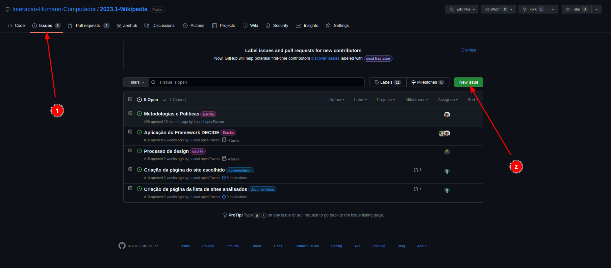

# Politica de Issues

## Introdução

Issue é um termo utilizado em gerenciamento de projetos e desenvolvimento de software para se referir a um problema, tarefa, sugestão ou ideia que precisa ser resolvida ou implementada. Esses issues podem ser identificados por qualquer membro da equipe ou pelo cliente, e são registrados em uma plataforma de gerenciamento de projetos, como o GitHub ou Jira.

## Criação

Como apresentado na figura 1, o primeiro passo para a criação de uma issue, é ir no github e na aba de issues.

Depois disso, clique em "New Issue".

 Figura 1: Demonstração para a criação da issue. 

Preencha o título da issue, e a descrição da issue, coloque também as tarefas e os critérios de aceitação.

Todos os campos são obrigatórios, e o idioma deve ser em português.

Finaliza a issue clicando em "Submit new issue". 

Os passos descritos são apresentados na figura 2.

 Figura 2: Demonstração para a descrição da issue. 

Preencha o assignee, este significa a pessoa ou a equipe que irá realizar a issue.

Por fim, selecione a label que mais se encaixa com a issue. Como  é apresentado na figura 3

 Figura 3: Assignees e labels para a criação das issues. 

## Histórico de versões

| Versão | Data       | Descrição                            | Autor(es) | Revisor(es)    |
| ------- | ---------- | -------------------------------------- | --------- | -------------- |
| 1.0     | 21/04/2023 | Criação do documento            | Lucas  | Chaydson            |

