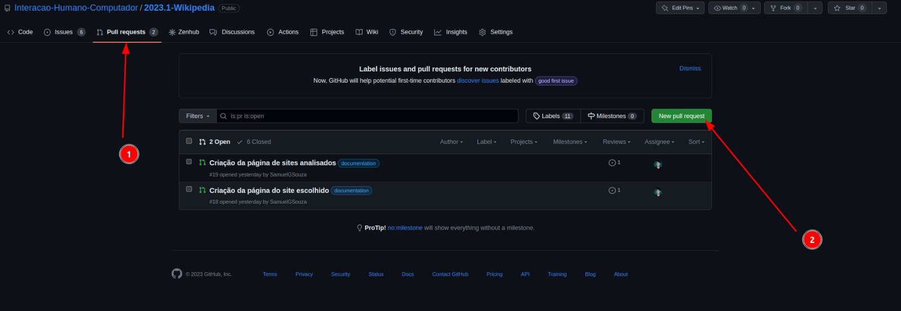
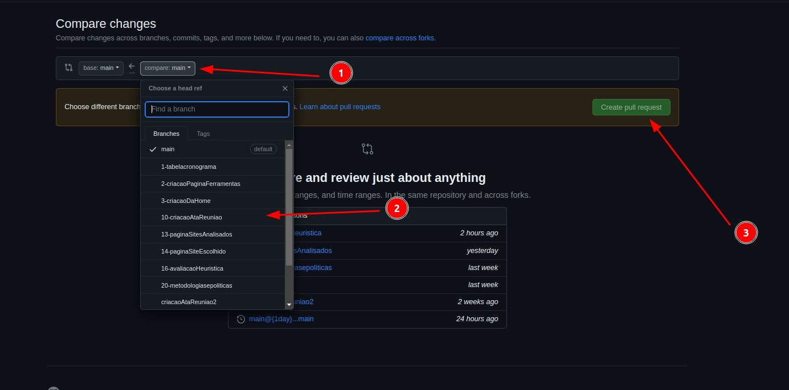
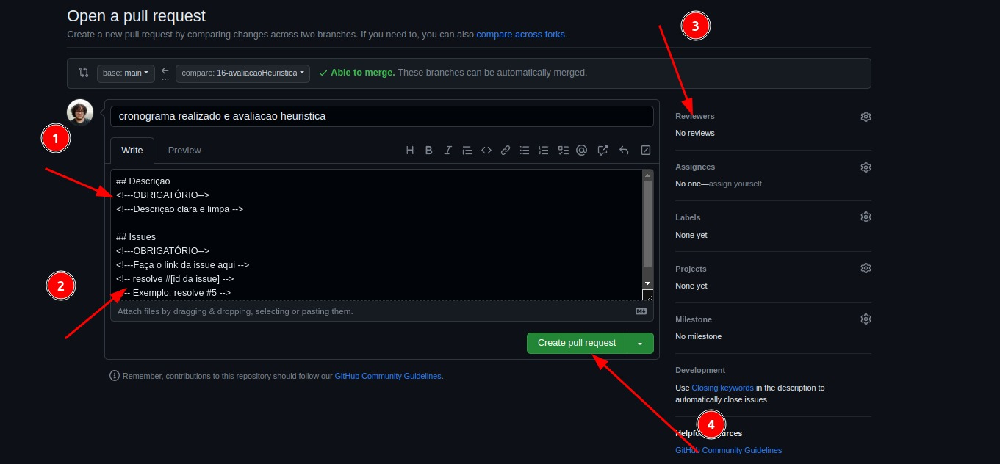

# Politica de Pull Request

## Introdução

Pull request é um recurso utilizado em plataformas de controle de versão, como o GitHub, para permitir que os desenvolvedores colaborem em um mesmo projeto de forma mais eficiente. Basicamente, um pull request é uma solicitação feita por um desenvolvedor para que suas alterações sejam mescladas com o código base do projeto.

## Criação

O primeiro passo para a criação do pull request é ir no github e clicar na aba de pull request. Como mostra a figura 1.

 Figura 1: Demonstração para a criação do pull request. 

Escolha a branch que irá fazer o pull request (A branch que irá receber é sempre a main), após isso, o github mostrará os arquivos que foram alterados, e você deve clicar no botão de criar pull request. Como mostra a figura 2.

 Figura 2: Demontração para a escolha da branch. 

O padrão utilizado aqui, é uma breve descrição do que foi feito, e o link da issue que foi resolvida acompanhada da palavra resolve. Como mostra a figura 3.

Exemplo: 

Adicionando metodologias e politicas de desenvolvimento

`resolve #20`

Por fim, coloque o revisor e finalize a criação do pull request.

 Figura 3: Demonstração para a finalização da criação do pull request. 

## Histórico de versões

| Versão | Data       | Descrição            | Autor(es) | Revisor(es) |
| ------- | ---------- | ---------------------- | --------- | ----------- |
| 1.0     | 21/04/2023 | Criação do documento | Lucas     | Chaydson    |
